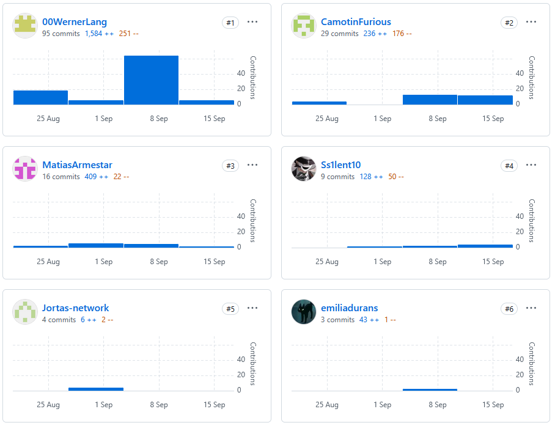

# UNIVERSIDAD PERUANA DE CIENCIAS APLICADAS

## Carrera: Ingeniería de Software
## Aplicaciones Web
## PROFESOR: Naldo Reupo-Musayon Gastulo
## NRC: 7426
## INFORME TB1
## START UP: WASwarm
## PRODUCTO: 

## INTEGRANTES:
| Apellidos y Nombres              | Código de Alumno |
|----------------------------------|------------------|
| Lang Nassi, Werner Khalil        | U202310003       |
| Taipe Sangama, Jorge Francisco   | U202313458       |
| Saúl, Ortega Muñoz               | U20231c019       |
| Armestar Heredia, Matias Gabriel | U20221A553       |
| Durán Santander, Emilia Mercedes | U201914541       |

Ciclo: 2025-20

# Registro de versiones del informe

| Versión | Fecha      | Autor                     |  Descripción de la modification            |
|---------|------------|---------------------------|--------------------------------------------|
| 0.1     | 2025-08-25 | Lang Nassi, Werner Khalil | Creación del documento y estructura inicial|

# Project Report Collaboration Insights
#### Repositorio del informe del proyecto 

El informe del proyecto está en el siguiente repositorio dentro de la organización de Github del equipo:

Enlace al repositorio: https://github.com/WASwarm1/final-report

#### Desarrollo del informe

Para la primera entrega (TB1), se trabajó la estructura inicial del informe, 
definiendo las secciones principales y asignando responsabilidades 
a cada miembro del equipo para completar las diferentes partes del documento. 
Se estableció un calendario de trabajo para asegurar que todas las secciones 
fueran revisadas y completadas a tiempo.

#### Evidencia de colaboración:

# Contenido

## Tabla de Contenidos
### [Registro de versiones del informe](#registro-de-versiones-del-informe)
### [Project Report Collaboration Insights](#project-report-collaboration-insights)
### [Contenido](#contenido)
### [Student Outcome](#student-outcome)
### [Capítulo I: Introducción](#capc3adtulo-i-introduccic3b3n-1)
- [1.1. Startup Profile](#11-startup-profile)
    - [1.1.1. Descripción de la Startup](#111-description-de-la-startup)
    - [1.1.2. Perfiles de integrantes del equipo](#112-perfiles-de-integrantes-del-equipo)
- [1.2. Solution Profile](#12-solution-profile)
    - [1.2.1 Antecedentes y problemática](#121-antecedentes-y-problemática)
    - [1.2.2 Lean UX Process](#122-lean-ux-process)
        - [1.2.2.1. Lean UX Problem Statements](#1221-lean-ux-problem-statements)
        - [1.2.2.2. Lean UX Assumptions](#1222-lean-ux-assumptions)
        - [1.2.2.3. Lean UX Hypothesis Statements](#1223-lean-ux-hypothesis-statements)
        - [1.2.2.4. Lean UX Canvas](#1224-lean-ux-canvas)
- [1.3. Segmentos objetivos](#13-segmentos-objetivos)

### [Capítulo II: Requirements Elicitation & Analysis](#capc3adtulo-ii-requirements-elicitation--analysis-1)
- [2.1. Competidores](#21-competidores)
    - [2.1.1. Análisis competitivo](#211-análisis-competitivo)
    - [2.1.2. Estrategias y tácticas frente a competidores](#212-estrategias-y-tácticas-frente-a-competidores)
- [2.2. Entrevistas](#22-entrevistas)
    - [2.2.1. Diseño de entrevistas](#221-diseño-de-entrevistas)
    - [2.2.2. Registro de entrevistas](#222-registro-de-entrevistas)
    - [2.2.3. Análisis de entrevistas](#223-análisis-de-entrevistas)
- [2.3. Needfinding](#23-needfinding)
    - [2.3.1. User Personas](#231-user-personas)
    - [2.3.2. User Task Matrix](#232-user-task-matrix)
    - [2.3.3. User Journey Mapping](#233-user-journey-mapping)
    - [2.3.4. Empathy Mapping](#234-empathy-mapping)
    - [2.3.5. As-is Scenario Mapping](#235-as-is-scenario-mapping)
    - [2.4. Ubiquitous Language](#24-Ubiquitous-language)
### [Capítulo III: Requirements Specification](#capc3adtulo-iii-requirements-specification-1)
- [3.1. To-Be Scenario Mapping](#31-to-be-scenario-mapping)
- [3.2. User Stories](#32-user-stories)
- [3.3. Impact Mapping](#33-impact-mapping)
- [3.4. Product Backlog](#34-product-backlog)

### [Capítulo IV: Product Design](#capc3adtulo-iv-product-design-1)
- [4.1. Style Guidelines](#41-style-guidelines)
    - [4.1.1. General Style Guidelines](#411-general-style-guidelines)
    - [4.1.2. Web Style Guidelines](#412-web-style-guidelines)
- [4.2. Information Architecture](#42-information-architecture)
    - [4.2.1. Organization Systems](#421-organization-systems)
    - [4.2.2. Labeling Systems](#422-labeling-systems)
    - [4.2.3. SEO Tags and Meta Tags](#423-seo-tags-and-meta-tags)
    - [4.2.4. Searching Systems](#424-searching-systems)
    - [4.2.5. Navigation Systems](#425-navigation-systems)
- [4.3. Landing Page UI Design](#43-landing-page-ui-design)
    - [4.3.1. Landing Page Wireframe](#431-landing-page-wireframe)
    - [4.3.2. Landing Page Mock-up](#432-landing-page-mock-up)
- [4.4. Web Applications UX/UI Design](#44-web-applications-uxui-design)
    - [4.4.1. Web Applications Wireframes](#441-web-applications-wireframes)
    - [4.4.2. Web Applications Wireflow Diagrams](#442-web-applications-wireflow-diagrams)
    - [4.4.3. Web Applications Mock-ups](#443-web-applications-mock-ups)
    - [4.4.4. Web Applications User Flow Diagrams](#444-web-applications-user-flow-diagrams)
- [4.5. Web Applications Prototyping](#45-web-applications-prototyping)
- [4.6. Domain-Driven Software Architecture](#46-domain-driven-software-architecture)
    - [4.6.1. Software Architecture Context Diagram](#461-software-architecture-context-diagram)
    - [4.6.2. Software Architecture Container Diagrams](#462-software-architecture-container-diagrams)
    - [4.6.3. Software Architecture Components Diagrams](#463-software-architecture-components-diagrams)
- [4.7. Software Object-Oriented Design](#47-software-object-oriented-design)
    - [4.7.1. Class Diagrams](#471-class-diagrams)
    - [4.7.2. Class Dictionary](#472-class-dictionary)
- [4.8. Database Design](#48-database-design)
    - [4.8.1. Database Diagram](#481-database-diagram)

### [Capítulo V: Product Implementation, Validation & Deployment](#capc3adtulo-v-product-implementation-validation--deployment-1)
- [5.1. Software Configuration Management](#51-software-configuration-management)
    - [5.1.1. Software Development Environment Configuration](#511-software-development-environment-configuration)
    - [5.1.2. Source Code Management](#512-source-code-management)
    - [5.1.3. Source Code Style Guide & Conventions](#513-source-code-style-guide--conventions)
    - [5.1.4. Software Deployment Configuration](#514-software-deployment-configuration)
- [5.2. Landing Page, Services & Applications Implementation](#52-landing-page-services--applications-implementation)
    - [5.2.1. Sprint 1](#521-sprint-1)
        - [5.2.1.1. Sprint Planning 1](#5211-sprint-planning-1)
        - [5.2.1.2. Sprint Backlog 1](#5212-sprint-backlog-1)
        - [5.2.1.3. Development Evidence for Sprint Review](#5213-development-evidence-for-sprint-review)
        - [5.2.1.4. Testing Suite Evidence for Sprint Review](#5214-testing-suite-evidence-for-sprint-review)
        - [5.2.1.5. Execution Evidence for Sprint Review](#5215-execution-evidence-for-sprint-review)
        - [5.2.1.6. Services Documentation Evidence for Sprint Review](#5216-services-documentation-evidence-for-sprint-review)
        - [5.2.1.7. Software Deployment Evidence for Sprint Review](#5217-software-deployment-evidence-for-sprint-review)
        - [5.2.1.8. Team Collaboration Insights during Sprint](#5218-team-collaboration-insights-during-sprint)

### [Conclusiones](#conclusiones-1)
- [Conclusiones y recomendaciones](#conclusiones-y-recomendaciones)

### [Bibliografía](#bibliografc3ada-1)
### [Anexos](#anexos-1)

# Student Outcome

El curso contribuye al cumplimiento del **Student Outcome ABET:ABET – EAC - Student Outcome 5**
**Criterio:** La capacidad de funcionar efectivamente en un equipo cuyos miembros juntos proporcionan 
liderazgo, crean un entorno de colaboración e inclusivo, establecen objetivos, planifican tareas 
y cumplen objetivos.

| Criterio específico                                                                             | Acciones realizadas                                                                                                                                                                                                                                                                                                                                                                                                                                                                                                                                                                                                                                                                                                                                                                                                                                                                                                                                                                                                                                                                                                                                                                                                                                                                       | Conclusiones                                                                                                                                                                                                                                                                                                                                                                                                                                                                                                                                                                                                                                                                                                |
|-------------------------------------------------------------------------------------------------|-------------------------------------------------------------------------------------------------------------------------------------------------------------------------------------------------------------------------------------------------------------------------------------------------------------------------------------------------------------------------------------------------------------------------------------------------------------------------------------------------------------------------------------------------------------------------------------------------------------------------------------------------------------------------------------------------------------------------------------------------------------------------------------------------------------------------------------------------------------------------------------------------------------------------------------------------------------------------------------------------------------------------------------------------------------------------------------------------------------------------------------------------------------------------------------------------------------------------------------------------------------------------------------------|-------------------------------------------------------------------------------------------------------------------------------------------------------------------------------------------------------------------------------------------------------------------------------------------------------------------------------------------------------------------------------------------------------------------------------------------------------------------------------------------------------------------------------------------------------------------------------------------------------------------------------------------------------------------------------------------------------------|
| Trabaja en equipo para proporcionar liderazgo en forma conjunta                                 | TB1:   Saul Ortega:   Colabore en la organizacion y comunicacion del equipo, aportando ideas, cumpliendo mis tareas y apoyando al grupo para lograr un trabajo conjunto.  Werner Lang:   En esta entrega establecí las metas y objetivos a lograr, así mismo logré cumplir con lo que se había propuesto. También colaboré en la proposición de objetivos para los miembros del equipo, y promoví la realización de las tareas el transcurso de la entrega.    Matias Armestar:  A través de la comunicación constante y consecuente coordinación con mis compañeros, pude aportar a la creación de un entorno colaborativo, así cumpliendo con la mayoría de objetivos y tareas planificadas.    Jorge Taipe:  Me encargué de investigar y gestionar las herramientas digitales y fuentes de información que el equipo necesitaba para trabajar de manera eficiente, asegurando que todos tuvieran acceso a los recursos clave para sus tareas    Emilia Duran:  Contribuí al ambiente colaborativo presentando mis avances en antecedentes, problemática y diseño de wireframes, integrando la retroalimentación del equipo.                                                                                              | Asumimos roles complementarios dentro del equipo, adaptando nuestra forma de colaborar según las necesidades del proyecto. Organizamos reuniones y fomentamos el consenso en momentos de debate, asegurando que cada aporte fuera considerado y unificado en una visión común. Durante el desarrollo, priorizamos la delegación de tareas, la comunicación efectiva y la revisión de calidad para mantenernos alineados con los objetivos. Además, combinamos la creatividad con la planificación, creando bases sólidas como los antecedentes, la problemática y los wireframes, lo que garantizó un avance ordenado, colaborativo y orientado a resultados.                                               |
| Crea un entorno colaborativo e inclusivo, establece metas, planifica tareas y cumple objetivos  | TB1:   Saul Ortega:   Participe en la creacion de un entorno colaborativo e inclusivo, aportando ideas en la definicion de metas, apoyando la planificacion de tareas y cumpliendo mis responsabilidades para contribuir al logro de los objetivos del equipo.     Werner Lang:   En esta entrega establecí las metas y objetivos a lograr, así mismo logré cumplir con lo que se había propuesto. También colaboré en la proposición de objetivos para los miembros del equipo, y promoví la realización de las tareas en el transcurso de la entrega.    Matias Armestar:   A través de la comunicación constante y consecuente coordinación con mis compañeros, pude aportar a la creación de un entorno colaborativo, cumpliendo con la mayoría de objetivos y tareas planificadas.   Jorge Taipe:   Me encargué de investigar y gestionar las herramientas digitales y fuentes de información que el equipo necesitaba para trabajar de manera eficiente, asegurando que todos tuvieran acceso a los recursos clave para sus tareas.   Emilia Duran:   Contribuí al ambiente colaborativo presentando mis avances en antecedentes, problemática y diseño de wireframes, integrando la retroalimentación del equipo.    | Establecimos metas claras y alcanzables, asegurando su cumplimiento mediante una planificación organizada y la delegación de responsabilidades. Promovimos un entorno colaborativo e inclusivo, en el que la comunicación constante y la coordinación entre los miembros facilitaron la integración de ideas y el logro de los objetivos. Además, gestionamos eficazmente herramientas digitales y recursos de información, garantizando que el equipo contara con lo necesario para trabajar de manera eficiente. Finalmente, integramos los aportes individuales en antecedentes, problemática y diseño de wireframes, reforzando un proceso de trabajo conjunto orientado a la calidad y los resultados. |
