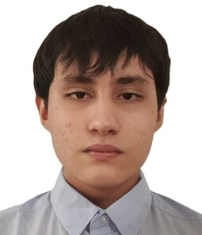

# Capitulo I: Introducción

## 1.1. Startup Profile

A continuación, se presenta el perfil de la startup WASwarm:

### 1.1.1. Descripción de la Startup

### 1.1.2. Perfiles de integrantes del equipo

|                         | Apellido y Nombre                                 | Carrera                | Acerca de                                                                                                                                        | Habilidades                                     |
|-------------------------|---------------------------------------------------|------------------------|--------------------------------------------------------------------------------------------------------------------------------------------------|-------------------------------------------------|
|  | Lang Nassi, Werner Khalil(u202310003)             | Ingeniería de Software | Estudiante de la Universidad Peruana de Ciencias Aplicadas (UPC), cursando en 6.º ciclo. Soy un estudiante que le gusta investigar cosas nuevas. | Investigador, Innovador, Analista, Cooperativo. |
|  | Taipe Sangama, Jorge Francisco                      | Ingeniería de Software | Soy estudiante que le gusta innovar y hacer proyectos personasles, me gustan las cosas desafiantes y trabajar bajo presion. | Perseverante, Creativo, Lider, Optimista        |
|  | Saúl, Ortega Muñoz                                  | Ingeniería de Software |Soy estudiante de Ingeniería de Software en 5.º ciclo, responsable y proactivo, con interés en el desarrollo de soluciones tecnológicas y en fortalecer mis habilidades para aportar en cada proyecto  | Responsable, leal, curioso                      |
|  | Armestar Heredia, Matias Gabriel (U20221A553)             | Ingeniería de Software | Estudiante de la Universidad Peruana de Ciencias Aplicadas (UPC). Me considero un estudiante capaz de aportar significativamente a un equipo. | Cooperativo y Puntual.                          |
|  |                                                   |                        |                                                                                                                                                  |                                                 |

## 1.2. Solution Profile

### 1.2.1. Antecedentes y problemática

**Antecedentes:**

**Problemática:**

**Técnica de The 5 'W's y 2 'H's**

### 1.2.2 Lean UX Process.

#### 1.2.2.1. Lean UX Problem Statements.

#### 1.2.2.2. Lean UX Assumptions.

#### 1.2.2.3. Lean UX Hypothesis Statements.

#### 1.2.2.4. Lean UX Canvas.

## 1.3. Segmentos objetivos.

### Segmento objetivo #1: 

### Segmento objetivo #2:
