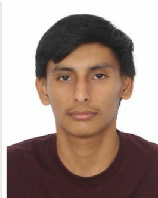

# Capitulo I: Introducción

## 1.1. Startup Profile

A continuación, se presenta el perfil de la startup WASwarm:

### 1.1.1. Descripción de la Startup

### 1.1.2. Perfiles de integrantes del equipo

|                         | Apellido y Nombre                                 | Carrera                | Acerca de                                                                                                                                        | Habilidades                                     |
|-------------------------|---------------------------------------------------|------------------------|--------------------------------------------------------------------------------------------------------------------------------------------------|-------------------------------------------------|
|  | Lang Nassi, Werner Khalil(u202310003)             | Ingeniería de Software | Estudiante de la Universidad Peruana de Ciencias Aplicadas (UPC), cursando en 6.º ciclo. Soy un estudiante que le gusta investigar cosas nuevas. | Investigador, Innovador, Analista, Cooperativo. |
|  | Taipe Sangama, Jorge Francisco                      | Ingeniería de Software | Soy estudiante que le gusta innovar y hacer proyectos personasles, me gustan las cosas desafiantes y trabajar bajo presion. | Perseverante, Creativo, Lider, Optimista        |
|  | Saúl, Ortega Muñoz                                  | Ingeniería de Software |Soy estudiante de Ingeniería de Software en 5.º ciclo, responsable y proactivo, con interés en el desarrollo de soluciones tecnológicas y en fortalecer mis habilidades para aportar en cada proyecto  | Responsable, leal, curioso                      |
|  | Armestar Heredia, Matias Gabriel (U20221A553)             | Ingeniería de Software | Estudiante de la Universidad Peruana de Ciencias Aplicadas (UPC). Me considero un estudiante capaz de aportar significativamente a un equipo. | Cooperativo y Puntual.                          |
|  |                                                   |                        |                                                                                                                                                  |                                                 |

## 1.2. Solution Profile

### 1.2.1. Antecedentes y problemática

**Antecedentes:**

**Problemática:**

**Técnica de The 5 'W's y 2 'H's**

### 1.2.2 Lean UX Process.

#### 1.2.2.1. Lean UX Problem Statements.

#### 1.2.2.2. Lean UX Assumptions.

#### 1.2.2.3. Lean UX Hypothesis Statements.

#### 1.2.2.4. Lean UX Canvas.

## 1.3. Segmentos objetivos.

### Segmento objetivo #1: Clientes: Usuarios que Contratan Servicios
Segmento Primario: "El Solucionador Práctico"
Este grupo busca una solución rápida, segura y eficiente para los problemas de su hogar, valorando su tiempo y tranquilidad por encima de todo.
#### Demografía:
- Edad: 18 a 60 años.
- Nivel Socioeconómico (NSE): A y B.
- Ocupación: Profesionales, empleados con jornadas laborales demandantes, jefes de hogar, o padres de familia.
- Ubicación: Residentes en distritos urbanos con alta densidad poblacional y comercial en Lima Metropolitana (ej. Miraflores, San Isidro, Surco, Jesús María, La Molina).
- Vivienda: Dueños de departamentos o casas, o inquilinos en contratos de largo plazo.
#### Psicografía:
- Valoran la seguridad: Les preocupa dejar entrar a un desconocido a su casa.
- Priorizan la calidad y garantía: Han tenido malas experiencias previas con servicios informales.
- Son tecnológicamente competentes: Usan aplicaciones para delivery, transporte y banca. Esperan una experiencia digital fluida.
- Están dispuestos a pagar un poco más por un servicio verificado, transparente y garantizado.

### Segmento objetivo #2: Técnicos: Profesionales que Ofrecen Servicios
Segmento Primario: "El Profesional Independiente"
Técnicos con experiencia y habilidades comprobadas que buscan formalizar su trabajo, aumentar sus ingresos y optimizar su tiempo.
#### Demografia:
- Edad: 25 a 60 años.
- Ocupación: Profesionales técnicos especializados en gasfitería, electricidad, cerrajería, carpintería, pintura, etc.
- Experiencia: Con al menos 3-5 años de experiencia demostrable en su oficio.
#### Psicografía y Comportamiento:
- Orgullosos de su trabajo: Buscan ser reconocidos por su habilidad y buen servicio.
- Frustrados con la informalidad: Cansados de la inestabilidad de "trabajos esporádicos" y la competencia desleal.
- Desean estabilidad económica: Quieren un flujo de clientes más predecible.
- Son usuarios de smartphones: Se sienten cómodos usando aplicaciones básicas como WhatsApp para coordinar con clientes. Buscan herramientas que les faciliten el trabajo, no que lo compliquen.