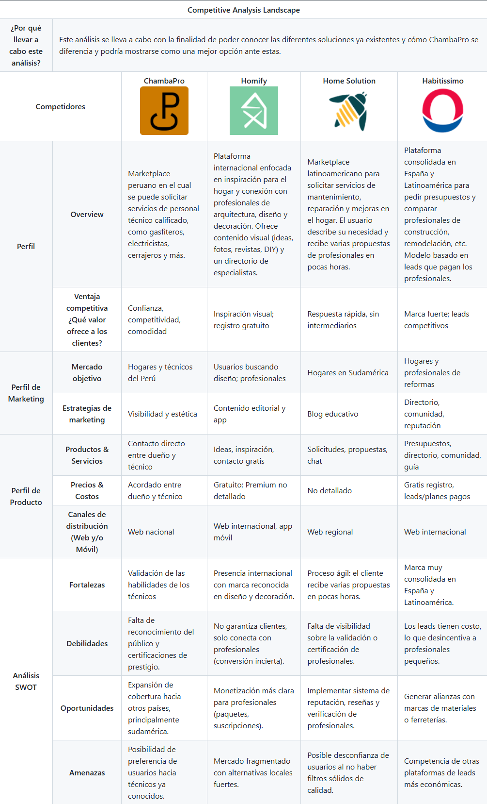
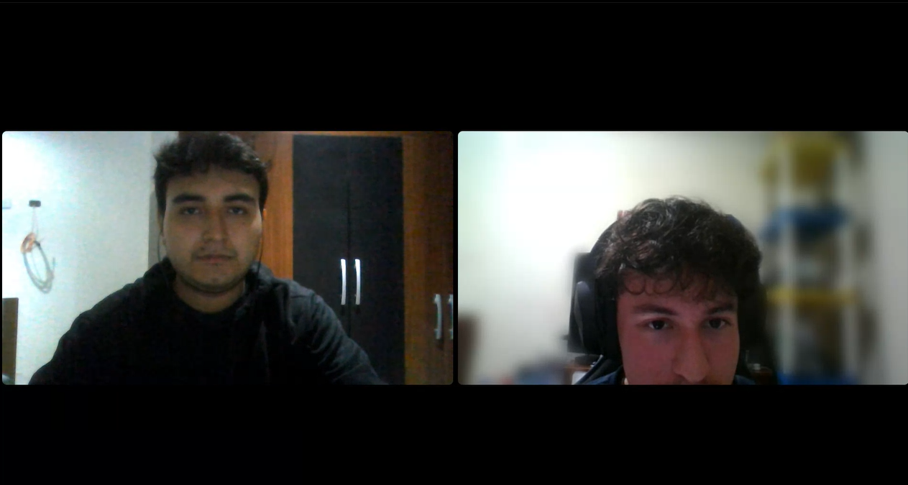

# Capítulo II: Requirements Elicitation & Analysis

## 2.1. Competidores.

En esta sección se identifican y describen los principales competidores de ChambaPro, tanto aquellos que actúan de manera directa en el mismo segmento de servicios técnicos como los que se ubican en sectores relacionados, como el diseño, mantenimiento y remodelación de hogares. El objetivo de este análisis es mostrar cómo se posiciona cada alternativa en el mercado y en qué medida se diferencian de la propuesta de ChambaPro.

Homify
Es una plataforma con presencia internacional cuyo enfoque está orientado a la inspiración en proyectos de vivienda y decoración. Se centra en conectar a los usuarios con profesionales de arquitectura y diseño, utilizando contenido visual atractivo como fotografías, revistas digitales y consejos de bricolaje. Aunque permite el contacto entre especialistas y clientes, su propuesta no asegura una conversión directa hacia proyectos contratados.

Home Solution
Se trata de un marketplace digital presente en distintos países de Latinoamérica que permite a los usuarios publicar sus necesidades relacionadas con reparaciones, mantenimiento o mejoras en el hogar. A partir de ello, los clientes reciben múltiples presupuestos de diferentes técnicos en un corto plazo. Su ventaja radica en la rapidez del proceso, aunque presenta limitaciones en cuanto a la validación de la experiencia y credenciales de los profesionales que participan en la plataforma.

Habitissimo
Es una marca consolidada en España y con gran penetración en mercados latinoamericanos, especializada en proyectos de construcción y remodelación. Su modelo de negocio consiste en que los profesionales pagan por acceder a oportunidades de clientes (leads), lo que ha permitido generar una amplia base de especialistas y una comunidad activa. Sin embargo, este esquema puede resultar poco atractivo para técnicos independientes o con menos recursos, debido al costo que implica participar.

### 2.1.1. Análisis competitivo.

### 2.1.2. Estrategias y tácticas frente a competidores.
#### Fortalezas y Oportunidades:
La principal fortaleza de ChambaPro es la confianza que brinda a los usuarios mediante la validación de las habilidades de los técnicos, así como la facilidad de contacto directo sin intermediarios innecesarios. Este valor diferencial permite posicionarse frente a competidores como Home Solution, que carece de mecanismos sólidos de verificación, o frente a Habitissimo, que centra su modelo en leads pagos.
*  Oportunidad: El mercado peruano y latinoamericano aún presenta baja digitalización en la contratación de técnicos para el hogar, lo cual genera un espacio ideal para que ChambaPro se consolide como un referente nacional y, posteriormente, regional. Esta oportunidad puede potenciarse mediante un plan de expansión gradual y una estrategia de confianza que combine calificaciones, reseñas y certificaciones verificables.

#### Aprovechamiento de Debilidades y Amenazas de los Competidores:
Competidores como Homify no aseguran la concreción de servicios, ya que su propuesta está más enfocada en inspiración que en ejecución, lo que deja un vacío para quienes buscan soluciones prácticas y rápidas. ChambaPro puede aprovechar esta debilidad promoviendo su enfoque en resultados tangibles y en la contratación efectiva de técnicos.
En el caso de Home Solution, la ausencia de filtros rigurosos para validar a los profesionales puede generar desconfianza. Aquí, ChambaPro debe posicionarse como una alternativa más segura, ofreciendo un sistema transparente de validación, reputación y reseñas.
*  Amenaza del entorno competitivo: La preferencia de los usuarios por técnicos de confianza previamente conocidos. Para mitigar este riesgo, ChambaPro debe implementar campañas de fidelización y programas de recomendación, incentivando a los usuarios a contratar nuevamente dentro de la plataforma y a recomendar técnicos con buenas calificaciones.

#### Estrategias de Marketing:
Se recomienda utilizar una estrategia de marketing digital segmentada, enfocada en hogares y técnicos en el Perú, destacando la comodidad, la seguridad y la competitividad de la plataforma frente a alternativas internacionales o poco personalizadas.
Las campañas deben incluir testimonios de clientes satisfechos y casos de éxito que generen credibilidad.
Otro punto clave es simplificar la experiencia de usuario: una interfaz clara y accesible que permita solicitar un servicio en pocos pasos, reforzando el valor de inmediatez frente a procesos más engorrosos de otros competidores.

#### Costos y Precios:
La estructura de precios debe mantenerse flexible y atractiva, basada en acuerdos directos entre usuarios y técnicos, lo que otorga autonomía y evita costos ocultos para los clientes. Esto representa una ventaja frente a modelos como Habitissimo, que carga con costos por leads.
Se recomienda establecer planes de monetización escalables, que incluyan desde opciones gratuitas para atraer profesionales independientes hasta planes premium con beneficios como mayor visibilidad, certificaciones destacadas y soporte preferencial.
## 2.2. Entrevistas.

### 2.2.1. Diseño la entrevistas.

A continuación, se presentan las preguntas para las entrevistas de cada sección. 
A demás, con la finalidad de no extender el tiempo de las entrevistas y facilitar información gráfica. 
Haciendo uso de la herramienta Fillout hemos recolectado información personal como por ejemplo las marcas de 
preferencia, dispositivos de uso, etc.

#### Preguntas para el segmento "Clientes"

* ¿Podría contarme la última vez que necesitó contratar un técnico para su hogar? ¿Qué tipo de servicio fue?
* ¿Cómo suele buscar técnicos cuando los necesita? (recomendaciones, internet, directorios, etc.)
* ¿Cuánto tiempo le toma normalmente encontrar un técnico confiable?
* ¿Ha tenido malas experiencias contratando técnicos? ¿Qué pasó?

* ¿Qué es lo primero que evalúa cuando va a contratar a un técnico?
* ¿Cómo decide si confiar o no en una persona que va a ingresar a su hogar?
* ¿Pregunta por los precios antes de contratar? ¿Cómo maneja las negociaciones?
* ¿Qué información le gustaría conocer sobre un técnico antes de contratarlo?

* ¿Qué es lo que más le preocupa cuando contrata servicios técnicos?
* ¿Ha tenido problemas con sobrecostos o trabajos de mala calidad? ¿Cómo los resolvió?
* ¿Qué pasa cuando tiene una emergencia en casa? (tubería rota, problema eléctrico, etc.)
* ¿Le resulta fácil encontrar técnicos disponibles cuando los necesita urgentemente?

* ¿Usa aplicaciones para solicitar servicios? (delivery, transporte, etc.)
* Si existiera una plataforma donde pueda encontrar técnicos verificados con precios transparentes, ¿la usaría?
* ¿Qué características consideraría más importantes en una app de este tipo?
* ¿Estaría dispuesto/a a pagar un poco más por mayor seguridad y garantía?

* ¿Cómo le gustaría que fuera el proceso ideal para contratar un técnico?
* ¿Qué tipo de garantías o respaldos esperaría de este servicio?
* ¿Prefiere agendar con anticipación o necesita disponibilidad inmediata?

#### Preguntas para el segmento "Técnicos"

* ¿Podría contarme sobre su trabajo? ¿En qué se especializa y cuántos años de experiencia tiene?
* ¿Cómo es un día típico de trabajo para usted?
* ¿Trabaja de forma independiente o para alguna empresa?
* ¿En qué distritos o zonas suele trabajar más?

* ¿Cómo consigue nuevos clientes habitualmente?
* ¿Qué tan predecible es su flujo de trabajo? ¿Hay épocas mejores que otras?
* ¿Ha usado internet o redes sociales para promocionar sus servicios?
* ¿Qué tan difícil es destacarse de otros técnicos en su rubro?

* ¿Cuáles son sus principales desafíos para conseguir trabajo constante?
* ¿Ha tenido problemas con clientes? ¿Qué tipo de situaciones?
* ¿Cómo maneja los precios? ¿Los negocia caso por caso o tiene tarifas fijas?
* ¿Qué pasa cuando un cliente no está conforme con su trabajo o no le quiere pagar?

* ¿Le gustaría formalizar más su trabajo? ¿Qué se lo impide?
* ¿Ha pensado en tener más herramientas para gestionar su trabajo y clientes?
* ¿Cómo lleva el control de sus citas, pagos y trabajos realizados?
* ¿Le interesaría tener una forma de construir su reputación profesional?

* ¿Usa smartphone? ¿Qué aplicaciones usa más?
* ¿Estaría dispuesto a usar una plataforma digital para conseguir más clientes?
* ¿Qué características le parecerían más útiles en una app para técnicos?
* ¿Aceptaría pagar una comisión por cada trabajo conseguido a través de una plataforma?

* Si hubiera una plataforma que le diera acceso a clientes verificados, con precios claros y pagos seguros, ¿la usaría?
* ¿Qué tipo de verificación o requisitos estaría dispuesto a cumplir para ser parte de la plataforma?
* ¿Cómo le gustaría que funcionara su perfil profesional en línea?
* ¿Qué beneficios esperaría obtener al formar parte de esta plataforma?

### 2.2.2. Registro de entrevistas.

#### Segmento 1: Clientes

- _Entrevista 1:_ 

| Nombre               | Sebastian                                                                                                                                                                                                                                                                                                                                                                                                                                              |
|----------------------|--------------------------------------------------------------------------------------------------------------------------------------------------------------------------------------------------------------------------------------------------------------------------------------------------------------------------------------------------------------------------------------------------------------------------------------------------------|
| Apellido             | Finetti                                                                                                                                                                                                                                                                                                                                                                                                                                                |
| Edad                 | 19                                                                                                                                                                                                                                                                                                                                                                                                                                                     |
| Distrito             | San Miguel                                                                                                                                                                                                                                                                                                                                                                                                                                             |
| Evidencia            |                                                                                                                                                                                                                                                                                                                                                                                                 |
| Url                  | [Entrevista](https://upcedupe-my.sharepoint.com/:v:/g/personal/u20221a553_upc_edu_pe/EVelmzXnBP5IpMLaPIZV24wBZc5bykWiRzXUhUNXzbUFzQ?nav=eyJyZWZlcnJhbEluZm8iOnsicmVmZXJyYWxBcHAiOiJTdHJlYW1XZWJBcHAiLCJyZWZlcnJhbFZpZXciOiJTaGFyZURpYWxvZy1MaW5rIiwicmVmZXJyYWxBcHBQbGF0Zm9ybSI6IldlYiIsInJlZmVycmFsTW9kZSI6InZpZXcifX0%3D&e=2U57tJ) |
| Inicio de entrevista | 00:10                                                                                                                                                                                                                                                                                                                                                                                                                                                  |    
| Fin de entrevista    | 05:54                                                                                                                                                                                                                                                                                                                                                                                                                                                  |

- Distrito de residencia: San Miguel
- Estado civil: Soltero
- Ocupación: Estudiante
- Dispositivo de preferencia: Smartphone
- Canales de interacción digital: Facebook, Whatsapp

Resumen: Sebastian es un estudiante de la cual su edad es 19, el cuenta que usualmente no necesita contactar técnicos
debido a que posee un familiar que se dedica a esas cosas. Sin embargo, el está interesado en una aplicación que pueda 
ayudarlo a encontrar a un buen técnico, el dice que tomaríaa mucho en cuenta las reseñas y datos del técnico a la hora de seleccionar uno.
Mostró estar de acuerdo con lo propuesto y que usaría la aplicación.

- _Entrevista 2:_

| Nombre               | Limber                                                                                                                                                                                                                                                                                                                                                                                                                                                 |
|----------------------|--------------------------------------------------------------------------------------------------------------------------------------------------------------------------------------------------------------------------------------------------------------------------------------------------------------------------------------------------------------------------------------------------------------------------------------------------------|
| Apellido             | Quispe                                                                                                                                                                                                                                                                                                                                                                                                                                                 |
| Edad                 | 20                                                                                                                                                                                                                                                                                                                                                                                                                                                     |
| Distrito             | San Miguel                                                                                                                                                                                                                                                                                                                                                                                                                                             |
| Evidencia            |                                                                                                                                                                                                                                                                                                                                                                                                 |
| Url                  | [Entrevista](https://upcedupe-my.sharepoint.com/:v:/g/personal/u20221a553_upc_edu_pe/EVelmzXnBP5IpMLaPIZV24wBZc5bykWiRzXUhUNXzbUFzQ?nav=eyJyZWZlcnJhbEluZm8iOnsicmVmZXJyYWxBcHAiOiJTdHJlYW1XZWJBcHAiLCJyZWZlcnJhbFZpZXciOiJTaGFyZURpYWxvZy1MaW5rIiwicmVmZXJyYWxBcHBQbGF0Zm9ybSI6IldlYiIsInJlZmVycmFsTW9kZSI6InZpZXcifX0%3D&e=2U57tJ) |
| Inicio de entrevista | 06:00                                                                                                                                                                                                                                                                                                                                                                                                                                                  |    
| Fin de entrevista    | 13:21                                                                                                                                                                                                                                                                                                                                                                                                                                                  |

- Distrito de residencia: San Miguel
- Estado civil: Soltero
- Ocupación: Estudiante y trabajador
- Dispositivo de preferencia: Smartphone
- Canales de interacción digital: Whatsapp, Instagram, Facebook

Resumen: Limber es un estudiante que también trabaja. Nos comenta que tuvo varios problemas cuando contacto a tecnicos anteriormente debido al trabajo ineficiente de estos. El dice que una de las principales preocupaciones 
al momento de contactar a un tecnico es la calidad del trabajo de este y tomaria en cuenta un precio rasonable.
Tambien nos comenta que estaria interesado en una aplicacion que pueda facilitarle contactar a los tecnicos que necesite y que quiere que tengan disponibilidad inmediata.

- _Entrevista 3:_

| Nombre               | Pedro                                                                                                                                                                                                                                                                                                                                                                                                                                                 |
|----------------------|--------------------------------------------------------------------------------------------------------------------------------------------------------------------------------------------------------------------------------------------------------------------------------------------------------------------------------------------------------------------------------------------------------------------------------------------------------|
| Apellido             | García                                                                                                                                                                                                                                                                                                                                                                                                                                                 |
| Edad                 | 50                                                                                                                                                                                                                                                                                                                                                                                                                                                     |
| Distrito             | Jesus María                                                                                                                                                                                                                                                                                                                                                                                                                                             |
| Evidencia            |                                                                                                                                                                                                                                                                                                                                                                                                 |
| Url                  | [Entrevista](https://upcedupe-my.sharepoint.com/:v:/g/personal/u20221a553_upc_edu_pe/EVelmzXnBP5IpMLaPIZV24wBZc5bykWiRzXUhUNXzbUFzQ?nav=eyJyZWZlcnJhbEluZm8iOnsicmVmZXJyYWxBcHAiOiJTdHJlYW1XZWJBcHAiLCJyZWZlcnJhbFZpZXciOiJTaGFyZURpYWxvZy1MaW5rIiwicmVmZXJyYWxBcHBQbGF0Zm9ybSI6IldlYiIsInJlZmVycmFsTW9kZSI6InZpZXcifX0%3D&e=2U57tJ) |
| Inicio de entrevista | 13:26                                                                                                                                                                                                                                                                                                                                                                                                                                                  |    
| Fin de entrevista    | 24:54                                                                                                                                                                                                                                                                                                                                                                                                                                                  |

- Distrito de residencia: Jesus María
- Estado civil: Casado
- Ocupación: Trabajador
- Dispositivo de preferencia: Smartphone
- Canales de interacción digital: Whatsapp

Resumen: Pedro, un padre de familia de 50 años, nos comenta que usualmente contacta técnicos recomendados por amigos y/o familiares y que esta, a su vez, es su única forma de confirmar la calidad de servicio que puede brindar el técnico en cuestión. También, él estaría dispuesto a utilizar una aplicación que pueda ayudarlo a encontrar un técnico calidad, incluso si esto demanda pagar un precio algo más elevado de lo común.

#### Segmento 2: Técnicos

- _Entrevista 1:_

| Nombre               | Gonzalo                                                                                                                                                                                                                                                                                                                                                                                                                                                |
|----------------------|--------------------------------------------------------------------------------------------------------------------------------------------------------------------------------------------------------------------------------------------------------------------------------------------------------------------------------------------------------------------------------------------------------------------------------------------------------|
| Apellido             | Elio                                                                                                                                                                                                                                                                                                                                                                                                                                                   |
| Edad                 | 56                                                                                                                                                                                                                                                                                                                                                                                                                                                     |
| Distrito             | Miraflores                                                                                                                                                                                                                                                                                                                                                                                                                                             |
| Evidencia            |                                                                                                                                                                                                                                                                                                                                                                                                 |
| Url                  | [Entrevista](https://upcedupe-my.sharepoint.com/:v:/g/personal/u20221a553_upc_edu_pe/EVelmzXnBP5IpMLaPIZV24wBZc5bykWiRzXUhUNXzbUFzQ?nav=eyJyZWZlcnJhbEluZm8iOnsicmVmZXJyYWxBcHAiOiJTdHJlYW1XZWJBcHAiLCJyZWZlcnJhbFZpZXciOiJTaGFyZURpYWxvZy1MaW5rIiwicmVmZXJyYWxBcHBQbGF0Zm9ybSI6IldlYiIsInJlZmVycmFsTW9kZSI6InZpZXcifX0%3D&e=2U57tJ) |
| Inicio de entrevista | 27:02                                                                                                                                                                                                                                                                                                                                                                                                                                                  |    
| Fin de entrevista    | 35:44                                                                                                                                                                                                                                                                                                                                                                                                                                                  |

- Distrito de residencia: Miraflores
- Estado civil: Casado
- Ocupación: Técnico de sillas de oficina
- Dispositivo de preferencia: Computadora y smartphone
- Canales de interacción digital: Facebook, WhatsApp, Mercado Libre

Gonzalo Elio se dedica desde hace ocho años a la reparación de sillas de oficina, principalmente cambiando pistones y
ocasionalmente realizando retapizados, trabajando tanto en oficinas como a domicilio, especialmente en zonas como
Miraflores, San Borja, Surco y San Isidro. Obtiene clientes principalmente mediante un anuncio en Mercado Libre
y referencias, con una temporada más activa hacia fin de año. Destaca la calidad de su servicio frente a la
competencia, manejando precios variables según el tipo de pieza y solicitando un 50% de adelanto para cada trabajo.
Está interesado en expandir su negocio, utilizar herramientas digitales para gestionar pedidos y facturación, y
se muestra dispuesto a pagar comisiones por clientes obtenidos a través de una plataforma digital, así como a cumplir
con verificaciones razonables para formalizar y promover su perfil en línea, resaltando su experiencia y testimonios
de clientes.

- _Entrevista 2:_

| Nombre               | Denilson                                                                                                                                                                                                                                                                                                                                                                                                                                               |
|----------------------|--------------------------------------------------------------------------------------------------------------------------------------------------------------------------------------------------------------------------------------------------------------------------------------------------------------------------------------------------------------------------------------------------------------------------------------------------------|
| Apellido             | Vasquez                                                                                                                                                                                                                                                                                                                                                                                                                                                |
| Edad                 | 24                                                                                                                                                                                                                                                                                                                                                                                                                                                     |
| Distrito             | Chorrillos                                                                                                                                                                                                                                                                                                                                                                                                                                             |
| Evidencia            |                                                                                                                                                                                                                                                                                                                                                                                                 |
| Url                  | [Entrevista](https://upcedupe-my.sharepoint.com/:v:/g/personal/u20221a553_upc_edu_pe/EVelmzXnBP5IpMLaPIZV24wBZc5bykWiRzXUhUNXzbUFzQ?nav=eyJyZWZlcnJhbEluZm8iOnsicmVmZXJyYWxBcHAiOiJTdHJlYW1XZWJBcHAiLCJyZWZlcnJhbFZpZXciOiJTaGFyZURpYWxvZy1MaW5rIiwicmVmZXJyYWxBcHBQbGF0Zm9ybSI6IldlYiIsInJlZmVycmFsTW9kZSI6InZpZXcifX0%3D&e=2U57tJ) |
| Inicio de entrevista | 35:48                                                                                                                                                                                                                                                                                                                                                                                                                                                  |    
| Fin de entrevista    | 46:58                                                                                                                                                                                                                                                                                                                                                                                                                                                  |

- Distrito de residencia: Chorrillos
- Estado civil: Soltero
- Ocupación: Técnico en Gasfiteria
- Dispositivo de preferencia: Caja de Herramientas
- Canales de interacción digital: WhatsApp, Facebook

Resumen:
Denilson es un técnico gasfitero (plomero) altamente experimentado e independiente con 15 años en el oficio. 
Se enorgullece de su honestidad, puntualidad y la calidad de su trabajo, ofreciendo garantías para construir confianza a largo plazo con sus clientes. 
Como su propio jefe, disfruta de la libertad de manejar su horario, pero lucha con la naturaleza impredecible de sus ingresos y los desafíos de competir con la mano de obra informal de bajo costo. 
Denilson es un solucionador de problemas práctico que depende en gran medida de su smartphone para gestionar sus operaciones diarias, desde la coordinación con clientes vía WhatsApp hasta la navegación por la ciudad. 
Aunque ha construido su negocio en base a recomendaciones de boca en boca, está abierto y deseoso de adoptar nuevas herramientas digitales que puedan proporcionarle un flujo de trabajo más estable, conectarlo con clientes serios y ayudarlo a construir una reputación profesional verificable en línea.

### 2.2.3. Análisis de entrevistas.

Los clientes jóvenes, como Sebastian y Limber, muestran interés en la aplicación principalmente por la confianza y 
facilidad de uso. Aunque Sebastian no suele necesitar técnicos por tener un familiar que lo ayuda, valoraría contar 
con la app como alternativa y resalta la importancia de reseñas y perfiles verificados. Limber, en cambio, ha tenido 
experiencias negativas con técnicos poco eficientes, por lo que da prioridad a la calidad del servicio, precios razonables 
y disponibilidad inmediata, necesidades muy frecuentes en usuarios que combinan estudio y trabajo.

Por otro lado, los técnicos experimentados, como Gonzalo y Denilson, evidencian la oportunidad de digitalizar su negocio. 
Gonzalo busca expandirse y está dispuesto a pagar comisiones y pasar verificaciones con tal de obtener más clientes y 
formalizarse, mientras que Denilson, con 15 años de experiencia, se enfrenta a la inestabilidad de ingresos y la 
competencia informal, pero ve en una plataforma como ChambaPro una manera de conseguir un flujo constante de clientes y 
consolidar una reputación profesional en línea. Ambos técnicos coinciden en la necesidad de herramientas digitales de 
gestión y visibilidad.

Perfiles identificados:
Clientes jóvenes (18-25 años, principalmente estudiantes) y técnicos experimentados (35-65 años).

Rangos de edad:
La mayoría de los clientes pertenecen a 18-25 años, mientras que los técnicos están en 36-65 años.

Dispositivos utilizados:
Todos los participantes usan smartphones (Android y Apple), confirmando que la app debe ser mobile-first.

Aplicaciones frecuentes:
WhatsApp es la más utilizada, seguida de Facebook e Instagram → la comunicación directa y las redes sociales generan confianza.

Expectativas de la plataforma:

Clientes: que resuelva problemas de manera rápida, sea fácil de usar y muestre información clara del técnico.

Técnicos: conseguir más clientes, promocionar servicios, y un sistema de calificaciones para reputación.

Funciones más solicitadas:

Calificaciones y reseñas.

Datos completos y transparentes del técnico.

Herramientas de gestión (agenda, facturación, promoción).

## 2.3. Needfinding.

### 2.3.1. User Persona.

Esta sección presenta las fichas de User Persona elaborada a partir del análisis de entrevistas y hallazgos del 
benchmarking. Cada arquetipo representa un segmento objetivo clave, reflejando sus características demográficas, 
comportamientos, necesidades, frustraciones y motivaciones. Estos perfiles permiten guiar el diseño centrado en el 
usuario, alineando la solución propuesta con contextos reales de uso.

#### Segmento 1: Clientes

Maria es una profesional de 38 años que vive en Lima con su familia. Busca técnicos confiables para 
reparaciones en su hogar, pero le preocupa la seguridad y la calidad del trabajo.

#### Segmento 2: Técnicos

Carlos es un técnico gasfitero de 42 años que trabaja de manera independiente en Lima. Busca más clientes y 
estabilidad laboral, pero le cuesta encontrar trabajo constante y lidiar con clientes difíciles.

### 2.3.2. User Task Matrix.

| Actividades                         | María Elena (Cliente) - Frecuencia / Importancia | Carlos Mendoza (Técnico) - Frecuencia / Importancia |
|-------------------------------------|--------------------------------------------------|-----------------------------------------------------|
| Buscar técnicos                     | Con Frecuencia / Alta                            | N/A / N/A                                           |
| Evaluar perfiles y calificaciones   | Siempre / Alta                                   | N/A / N/A                                           |
| Solicitar servicios                 | Con Frecuencia / Alta                            | N/A / N/A                                           |
| Comunicarse con técnicos via chat   | Siempre / Alta                                   | N/A / N/A                                           |
| Agendar citas                       | Siempre / Alta                                   | Siempre / Alta                                      |
| Confirmar detalles del servicio     | Siempre / Alta                                   | Siempre / Alta                                      |
| Recibir técnicos en casa            | Siempre / Alta                                   | N/A / N/A                                           |
| Supervisar trabajo realizado        | Siempre / Alta                                   | N/A / N/A                                           |
| Realizar pagos                      | Siempre / Alta                                   | N/A / N/A                                           |
| Calificar servicios                 | Siempre / Media                                  | Rara vez / Baja                                     |
| Escribir reseñas                    | Con Frecuencia / Media                           | N/A / N/A                                           |
| Gestionar perfil personal           | Rara vez / Media                                 | Con Frecuencia / Alta                               |
| Actualizar disponibilidad           | N/A / N/A                                        | Siempre / Alta                                      |
| Aceptar/rechazar solicitudes        | N/A / N/A                                        | Siempre / Alta                                      |
| Ejecutar servicios técnicos         | N/A / N/A                                        | Siempre / Alta                                      |
| Gestionar agenda de trabajo         | N/A / N/A                                        | Siempre / Alta                                      |
| Revisar ingresos y métricas         | N/A / N/A                                        | Con Frecuencia / Alta                               |
| Subir fotos de trabajos             | N/A / N/A                                        | Con Frecuencia / Media                              |
| Actualizar portafolio               | N/A / N/A                                        | Con Frecuencia / Media                              |
| Gestionar herramientas y materiales | N/A / N/A                                        | Siempre / Alta                                      |
| Contactar soporte de plataforma     | Rara vez / Alta                                  | Rara vez / Alta                                     |
| Guardar técnicos concurrentes       | Con Frecuencia / Media                           | N/A / N/A                                           |
| Programar servicios recurrentes     | Con Frecuencia / Alta                            | Con Frecuencia / Media                              |
| Verificar antecedentes              | Rara vez / Alta                                  | Rara vez / Alta                                     |
| Capacitarse en uso de plataforma    | Rara vez / Media                                 | Con Frecuencia / Media                              |
| Recomendar plataforma a otros       | Con Frecuencia / Media                           | Con Frecuencia / Media                              |
| Gestionar métodos de pago           | Con Frecuencia / Media                           | Con Frecuencia / Media                              |
| Resolver disputas o reclamos        | Rara vez / Alta                                  | Rara vez / Alta                                     |
| Mantener comunicación post-servicio | Con Frecuencia / Media                           | Con Frecuencia / Media                              |

### 2.3.3. User Journey Mapping.

En esta sección se presentan los User Journey Maps en su versión As-Is, uno por cada User Persona definida. 
Cada journey refleja el recorrido actual que realiza el usuario en su contexto real de trabajo, desde el 
inicio hasta el fin de sus actividades clave, sin la existencia de una solución tecnológica. Estos mapas 
permiten identificar puntos de fricción, oportunidades de mejora y momentos críticos que guían el diseño 
centrado en el usuario. Los journeys están directamente vinculados a los arquetipos previamente definidos.

### Segmento 1: Clientes

### Segmento 2: Técnicos

### 2.3.4. Empathy Mapping.

En esta sección se presentan los Empathy Maps, uno por cada User Persona definida. Cada mapa refleja
las percepciones, pensamientos, sentimientos y comportamientos del usuario en su contexto real de trabajo,
sin la existencia de una solución tecnológica. Estos mapas permiten profundizar en la comprensión del
usuario, identificando sus necesidades emocionales y racionales, lo que guía el diseño centrado en el usuario.
Los empathy maps están directamente vinculados a los arquetipos previamente definidos.

#### Segmento 1: Clientes

#### Semento 2: Técnicos

### 2.3.5. As-is Scenario Mapping.

**Segmento 1: Clientes**

<table border="1" cellpadding="6" cellspacing="0">
  <thead>
    <tr>
      <th>Phases</th>
      <th>Descubrimiento</th>
      <th>Evaluación</th>
      <th>Contratación</th>
      <th>Pago y Postservicio</th>
    </tr>
  </thead>
  <tbody>
    <tr>
      <td><strong>Doing</strong></td>
      <td>Busca técnicos en redes, recomendaciones o directorios.</td>
      <td>Revisa fotos, precios, comentarios en redes.</td>
      <td>Negocia precio y disponibilidad de forma informal.</td>
      <td>Paga en efectivo o transferencia sin recibo.</td>
    </tr>
    <tr>
      <td><strong>Thinking</strong></td>
      <td>"¿A quién contrato? No sé si será confiable."</td>
      <td>"¿Este técnico realmente tiene experiencia? ¿Y si me estafa?"</td>
      <td>"Ojalá cumpla lo acordado y llegue a tiempo."</td>
      <td>"No tengo cómo reclamar si hay problemas."</td>
    </tr>
    <tr>
      <td><strong>Feeling</strong></td>
      <td>Inseguridad, desconfianza.</td>
      <td>Duda, desconfianza, riesgo.</td>
      <td>Nerviosismo, expectativa.</td>
      <td>Riesgo, desprotección.</td>
    </tr>
  </tbody>
</table>

**Segmento 2: Técnicos**

<table border="1" cellpadding="6" cellspacing="0">
  <thead>
    <tr>
      <th>Phases</th>
      <th>Descubrimiento</th>
      <th>Evaluación</th>
      <th>Contratación</th>
      <th>Pago y Postservicio</th>
    </tr>
  </thead>
  <tbody>
    <tr>
      <td><strong>Doing</strong></td>
      <td>Publica anuncios en Facebook, coloca volantes, depende del boca a boca.</td>
      <td>Negocia por WhatsApp o llamada sin garantía de cierre.</td>
      <td>Cierra trato verbal o con mensajes, sin contrato formal.</td>
      <td>Recibe el pago directamente, sin historial ni reputación formal.</td>
    </tr>
    <tr>
      <td><strong>Thinking</strong></td>
      <td>"Necesito más clientes, pero no sé cómo llegar a ellos."</td>
      <td>"El cliente puede no confiar en mí o cancelar a último momento."</td>
      <td>"Espero que el cliente me pague lo que prometió."</td>
      <td>"No puedo demostrar mis trabajos pasados a nuevos clientes."</td>
    </tr>
    <tr>
      <td><strong>Feeling</strong></td>
      <td>Frustración, ansiedad.</td>
      <td>Incertidumbre, vulnerabilidad.</td>
      <td>Expectativa, inseguridad.</td>
      <td>Falta de respaldo, limitado crecimiento.</td>
    </tr>
  </tbody>
</table>

## 2.4. Ubiquitous Language.

El Ubiquitous Language es un vocabulario común y preciso que debe ser utilizado por todos 
los miembros del equipo para referirse a los conceptos del dominio del negocio de ChambaPro. 
Este lenguaje elimina ambigüedades y asegura que todos hablen el mismo idioma.

* Client (Cliente): Persona que utiliza la plataforma para solicitar servicios técnicos para su hogar o 
propiedad, buscando profesionales confiables y verificados.
* Technician (Técnico): Profesional especializado en servicios técnicos (gasfitería, electricidad, cerrajería, etc.) 
que ofrece sus servicios a través de la plataforma ChambaPro.
* Service Request (Solicitud de servicio): Petición creada por un Cliente especificando el tipo de trabajo 
técnico necesario, ubicación, horario preferido y detalles específicos del problema.
* Verification (Verificación): Proceso mediante el cual ChambaPro válida la identidad, referencias laborales y 
habilidades técnicas de un profesional antes de aprobar su participación en la plataforma.
* Service Category (Categoría de servicio): Clasificación principal de los trabajos técnicos ofrecidos en la plataforma 
(Plumbing/Gasfitería, Electrical/Electricidad, Locksmithing/Cerrajería, Carpentry/Carpintería, etc.).
* Rating (Calificación): Puntuación numérica del 1 a 5 estrellas que un Cliente otorga a un Técnico después de 
completar un servicio, evaluando calidad, puntualidad y profesionalismo.
* Secure Payment (Pago seguro): Sistema mediante el cual ChambaPro retiene el pago del Cliente hasta que el 
servicio se complete satisfactoriamente, garantizando protección para ambas partes.
* Service Zone (Zona de servicio): Área geográfica específica donde un Técnico está dispuesto y capacitado 
para brindar sus servicios, optimizando tiempos de traslado.
* Quote (Cotización): Precio específico propuesto por un Técnico para una Solicitud de Servicio particular, 
basado en la complejidad y materiales requeridos.
* Platform Commission (Comisión de plataforma): Porcentaje del valor total del servicio que ChambaPro retiene como 
compensación por facilitar la conexión y garantizar la transacción.
* Professional Profile (Perfil profesional): Información completa de un Técnico que incluye especialidades, 
experiencia, portafolio de trabajos, calificaciones y certificaciones verificadas.
* Service Completion (Finalización de servicio): Estado que indica que el trabajo técnico ha sido ejecutado 
satisfactoriamente y confirmado tanto por el Técnico como por el Cliente.
* Response Time (Tiempo de respuesta): Período que transcurre entre la publicación de una Solicitud de Servicio y 
la primera respuesta o cotización de un Técnico disponible.
* Customer Satisfaction (Satisfacción del cliente): Medición del nivel de conformidad de los Clientes con la calidad 
del servicio recibido, el proceso de contratación y la experiencia general en la plataforma.
* Service History (Historial de servicios): Registro completo de todos los trabajos realizados por un Técnico o 
solicitados por un Cliente, incluyendo calificaciones, fechas y detalles del servicio.
