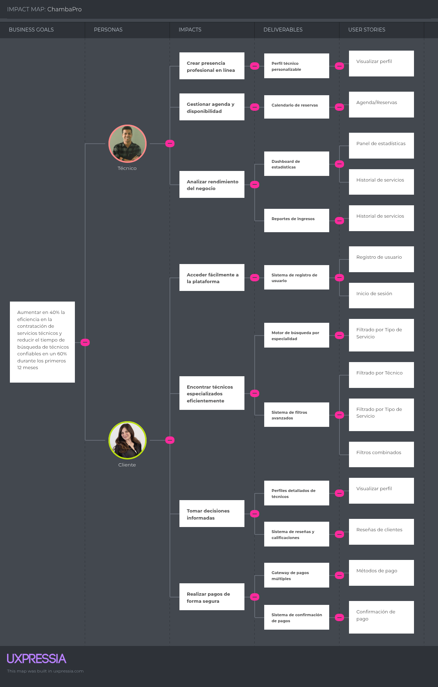

# Capítulo III: Requirements Specification

## 3.1. To-Be Scenario Mapping.

## 3.2. User Stories.

### Epics

| Epic  | Título                               | Descripción                                                                                                                                          | Criterios de aceptación                                                                                                                                              |
|-------|--------------------------------------|------------------------------------------------------------------------------------------------------------------------------------------------------|----------------------------------------------------------------------------------------------------------------------------------------------------------------------|
| EP01  | Información sobre startup y producto | Como visitante quiero visualizar información sobre ChambaPro y el equipo detrás del proyecto para conocer la propuesta de valor y generar confianza. | Escenario: Dado que soy visitante, cuando entro a la sección "Sobre nosotros", entonces puedo ver la misión, visión, descripción del producto y al equipo fundador.  |
| EP02  | Beneficios y Features de producto    | Como visitante quiero ver los beneficios de usar ChambaPro para evaluar si me conviene.                                                              | Escenario: Dado que estoy en la landing, cuando bajo hasta la sección de beneficios, entonces visualizo íconos, texto breve y ejemplos que muestran ventajas claras. |
| EP03  | Call to Action                       | Como visitante quiero encontrar botones de acción claros para registrarme en la app o contactar al equipo.                                           | Escenario: Dado que estoy en la landing, cuando llego a la parte superior e inferior, entonces encuentro botones visibles de “Regístrate” y “Contáctanos”.           |
| EP04  | Registro y autenticación             | Como usuario, quiero registrarme e iniciar sesión en la plataforma para acceder a mis funcionalidades de manera segura.                              | Escenario: Dado que soy usuario, cuando ingreso mis credenciales o me registro, entonces puedo autenticarme y acceder a mi cuenta.                                   |
| EP05  | Analíticas                           | Como usuario, quiero acceder a mi historial de servicios y a reportes de uso para llevar un control de mis actividades y resultados.                 | Escenario: Dado que soy usuario, cuando entro a la sección de analíticas, entonces puedo ver mi historial de servicios y métricas relevantes.                        |
| EP06  | Servicios                            | Como cliente, quiero filtrar y buscar servicios por categoría y técnico para encontrar la mejor opción disponible de acuerdo a mis necesidades.      | Escenario: Dado que soy cliente, cuando utilizo los filtros de búsqueda, entonces obtengo resultados de técnicos que cumplen con mis criterios.                      |
| EP07  | Perfil de Técnico                    | Como cliente, quiero acceder al perfil detallado de los técnicos para conocer su experiencia, calificaciones y reseñas antes de contratarlos.        | Escenario: Dado que soy cliente, cuando accedo al perfil de un técnico, entonces puedo visualizar su información, calificaciones y reseñas.                          |
| EP08  | Pago                                 | Como cliente, quiero realizar pagos seguros dentro de la plataforma para completar la contratación de servicios y obtener comprobantes electrónicos. | Escenario: Dado que soy cliente, cuando realizo un pago en la plataforma, entonces recibo confirmación y un comprobante digital.                                     |
| EP09  | Technical Stories                    | Desarrollo de endpoints necesarios                                                                                                                   |                                                                                                                                                                      |

### User Stories

| Story ID | Título                                                            | Descripción                                                                                                                                                                                                           | Criterios de Aceptación                                                                                                                                                                                                                                                                                                                                                                                                                                                                                                                                                                                                                                                                                                                                                                                                                                                                                                                                                                                                                                                                                                                                                                                                                                                                                                                                                                                            | Relacionado con Epic ID |
|----------|-------------------------------------------------------------------|-----------------------------------------------------------------------------------------------------------------------------------------------------------------------------------------------------------------------|--------------------------------------------------------------------------------------------------------------------------------------------------------------------------------------------------------------------------------------------------------------------------------------------------------------------------------------------------------------------------------------------------------------------------------------------------------------------------------------------------------------------------------------------------------------------------------------------------------------------------------------------------------------------------------------------------------------------------------------------------------------------------------------------------------------------------------------------------------------------------------------------------------------------------------------------------------------------------------------------------------------------------------------------------------------------------------------------------------------------------------------------------------------------------------------------------------------------------------------------------------------------------------------------------------------------------------------------------------------------------------------------------------------------|-------------------------|
| US 01    | Ver descripción del producto                                      | Como visitante quiero ver qué problema resuelve ChambaPro para entender cómo puede ayudarme.                                                                                                                          | Escenario: Dado que ingreso a la landing, cuando leo la descripción del producto, entonces veo en lenguaje claro su funcionalidad y beneficios principales.                                                                                                                                                                                                                                                                                                                                                                                                                                                                                                                                                                                                                                                                                                                                                                                                                                                                                                                                                                                                                                                                                                                                                                                                                                                        | EP01                    |
| US 02    | Conocer al equipo fundador                                        | Como visitante quiero conocer a los integrantes del equipo para confiar más en la startup.                                                                                                                            | Escenario: Dado que ingreso a “Sobre nosotros”, cuando veo la sección del equipo, entonces aparecen fotos, nombres, roles y una breve descripción de cada miembro.                                                                                                                                                                                                                                                                                                                                                                                                                                                                                                                                                                                                                                                                                                                                                                                                                                                                                                                                                                                                                                                                                                                                                                                                                                                 | EP01                    |
| US 03    | Ver misión y visión                                               | Como visitante quiero conocer la misión y visión de la startup para comprender su propósito.                                                                                                                          | Escenario: Dado que estoy en la sección "Sobre nosotros", cuando leo la misión y visión, entonces entiendo los objetivos y valores de ChambaPro.                                                                                                                                                                                                                                                                                                                                                                                                                                                                                                                                                                                                                                                                                                                                                                                                                                                                                                                                                                                                                                                                                                                                                                                                                                                                   | EP01                    |
| US 04    | Ver beneficios para clientes                                      | Como visitante que busca servicios quiero ver cómo ChambaPro me facilita encontrar técnicos confiables.                                                                                                               | Escenario: Dado que estoy en la sección de beneficios, cuando leo las ventajas para clientes, entonces entiendo que puedo buscar, agendar y pagar de manera segura.                                                                                                                                                                                                                                                                                                                                                                                                                                                                                                                                                                                                                                                                                                                                                                                                                                                                                                                                                                                                                                                                                                                                                                                                                                                | EP02                    |
| US 05    | Ver beneficios para técnicos                                      | Como visitante técnico quiero ver cómo ChambaPro me ayuda a conseguir más clientes y gestionar mis ingresos.                                                                                                          | Escenario: Dado que estoy en la sección de beneficios, cuando leo las ventajas para técnicos, entonces entiendo que puedo registrarme, ofrecer servicios y recibir pagos seguros.                                                                                                                                                                                                                                                                                                                                                                                                                                                                                                                                                                                                                                                                                                                                                                                                                                                                                                                                                                                                                                                                                                                                                                                                                                  | EP02                    |
| US 06    | Ver botón de registro                                             | Como visitante quiero un botón de “Regístrate” visible para iniciar el proceso fácilmente.                                                                                                                            | Escenario: Dado que estoy en la cabecera de la landing, cuando veo el botón de registro, entonces puedo hacer clic y redirigirme al formulario.                                                                                                                                                                                                                                                                                                                                                                                                                                                                                                                                                                                                                                                                                                                                                                                                                                                                                                                                                                                                                                                                                                                                                                                                                                                                    | EP03                    |
| US 07    | Ver botón de contacto                                             | Como visitante quiero tener acceso rápido a contacto con ChambaPro para resolver dudas.                                                                                                                               | Escenario: Dado que estoy en el pie de página, cuando veo la sección de contacto, entonces encuentro email, teléfono o formulario.                                                                                                                                                                                                                                                                                                                                                                                                                                                                                                                                                                                                                                                                                                                                                                                                                                                                                                                                                                                                                                                                                                                                                                                                                                                                                 | EP03                    |
| US 08    | Registro de usuario                                               | Como usuario, quiero registrar mis datos personales y correo electrónico para acceder a la plataforma                                                                                                                 | Escenario 1: Registro exitoso - Dado que el usuario ingresa datos válidos, cuando envía el formulario de registro, entonces el sistema crea la cuenta y muestra mensaje de éxito. Escenario 2: Registro fallido por correo repetido - Dado que el usuario ingresa un correo existente, cuando envía el formulario, entonces el sistema muestra un mensaje de error.                                                                                                                                                                                                                                                                                                                                                                                                                                                                                                                                                                                                                                                                                                                                                                                                                                                                                                                                                                                                                                                | EP04                    |
| US 09    | Inicio de sesión                                                  | Como usuario, quiero iniciar sesión con mis credenciales para acceder a mi cuenta                                                                                                                                     | Escenario 1: Inicio exitoso - Dado que el usuario ingresa datos válidos, cuando ingresa correo y contraseña correctos, entonces el sistema lo dirige a su panel. Escenario 2: Inicio fallido - Dado que el usuario ingresa credenciales inválidas, cuando intenta iniciar sesión, entonces el sistema muestra un mensaje de error.                                                                                                                                                                                                                                                                                                                                                                                                                                                                                                                                                                                                                                                                                                                                                                                                                                                                                                                                                                                                                                                                                 | EP04                    |
| US 10    | Historial de servicios                                            | Como usuario, quiero ver un historial de servicios solicitados para revisar mis actividades anteriores                                                                                                                | Escenario 1: Consulta de historial - Dado que el usuario tiene servicios registrados, cuando accede al historial de servicios, entonces el sistema muestra fecha, técnico, costo y estado.                                                                                                                                                                                                                                                                                                                                                                                                                                                                                                                                                                                                                                                                                                                                                                                                                                                                                                                                                                                                                                                                                                                                                                                                                         | EP05                    |
| US 11    | Agenda/Reservas                                                   | Como técnico, quiero ver un calendario de reservas para organizar mi tiempo y evitar conflictos                                                                                                                       | Escenario 1: Visualización de agenda - Dado que el técnico tiene servicios confirmados, cuando accede a su agenda, entonces el sistema muestra citas con fecha y hora.                                                                                                                                                                                                                                                                                                                                                                                                                                                                                                                                                                                                                                                                                                                                                                                                                                                                                                                                                                                                                                                                                                                                                                                                                                             | EP05                    |
| US 12    | Panel de estadísticas                                             | Como técnico, quiero ver estadísticas de mis servicios para analizar mi desempeño                                                                                                                                     | Escenario 1: Consulta de métricas - Dado que el técnico tiene servicios completados, cuando abre el panel de estadísticas, entonces el sistema muestra ingresos, calificaciones y cantidad de servicios.                                                                                                                                                                                                                                                                                                                                                                                                                                                                                                                                                                                                                                                                                                                                                                                                                                                                                                                                                                                                                                                                                                                                                                                                           | EP06                    |
| US 13    | Filtrado por Tipo de Servicio                                     | Como cliente, quiero filtrar técnicos por servicio para encontrar especialistas en lo que necesito                                                                                                                    | Escenario 1: Filtrado por categoría - Dado que el cliente selecciona un servicio, cuando aplica el filtro, entonces el sistema muestra solo técnicos de esa categoría.                                                                                                                                                                                                                                                                                                                                                                                                                                                                                                                                                                                                                                                                                                                                                                                                                                                                                                                                                                                                                                                                                                                                                                                                                                             | EP06                    |
| US 14    | Filtrado por Técnico                                              | Como cliente, quiero buscar un técnico por su nombre para contratar directamente a la persona que conozco                                                                                                             | Escenario 1: Búsqueda por nombre - Dado que el cliente ingresa el nombre de un técnico, cuando ejecuta la búsqueda, entonces el sistema muestra el perfil del técnico.                                                                                                                                                                                                                                                                                                                                                                                                                                                                                                                                                                                                                                                                                                                                                                                                                                                                                                                                                                                                                                                                                                                                                                                                                                             | EP06                    |
| US 15    | Filtros combinados                                                | Como cliente, quiero aplicar filtros combinados de categoría y ubicación para encontrar el técnico más adecuado                                                                                                       | Escenario 1: Búsqueda avanzada - Dado que el cliente selecciona múltiples filtros, cuando realiza la búsqueda, entonces el sistema muestra solo técnicos que cumplen con todos los criterios.                                                                                                                                                                                                                                                                                                                                                                                                                                                                                                                                                                                                                                                                                                                                                                                                                                                                                                                                                                                                                                                                                                                                                                                                                      | EP06                    |
| US 16    | Visualizar perfil                                                 | Como cliente, quiero ver el perfil del técnico para conocer sus datos, experiencia y certificaciones                                                                                                                  | Escenario 1: Acceso a perfil - Dado que el cliente selecciona un técnico, cuando abre su perfil, entonces el sistema muestra información general, experiencia y servicios.                                                                                                                                                                                                                                                                                                                                                                                                                                                                                                                                                                                                                                                                                                                                                                                                                                                                                                                                                                                                                                                                                                                                                                                                                                         | EP07                    |
| US 17    | Reseñas de clientes                                               | Como cliente, quiero dejar mi reseña después de un servicio para compartir mi experiencia con otros                                                                                                                   | Escenario 1: Envío de reseña - Dado que el cliente completó un servicio, cuando redacta su reseña y calificación, entonces el sistema la publica en el perfil del técnico.                                                                                                                                                                                                                                                                                                                                                                                                                                                                                                                                                                                                                                                                                                                                                                                                                                                                                                                                                                                                                                                                                                                                                                                                                                         | EP07                    |
| US 18    | Métodos de pago                                                   | Como cliente, quiero elegir entre diferentes métodos de pago para completar mi transacción                                                                                                                            | Escenario 1: Selección de método - Dado que el cliente confirma el servicio, cuando selecciona tarjeta o billetera digital, entonces el sistema procesa el pago.                                                                                                                                                                                                                                                                                                                                                                                                                                                                                                                                                                                                                                                                                                                                                                                                                                                                                                                                                                                                                                                                                                                                                                                                                                                   | EP08                    |
| US 19    | Confirmación de pago                                              | Como cliente, quiero recibir confirmación de mi pago para tener seguridad de que la transacción fue exitosa                                                                                                           | Escenario 1: Pago exitoso - Dado que el sistema valida el pago, cuando se finaliza la transacción, entonces muestra mensaje de confirmación y envía comprobante digital. Escenario 2: Error en transacción - Dado que el cliente ingresa datos inválidos o fondos insuficientes, cuando procesa el pago, entonces el sistema muestra un mensaje de error y permite reintentar.                                                                                                                                                                                                                                                                                                                                                                                                                                                                                                                                                                                                                                                                                                                                                                                                                                                                                                                                                                                                                                     | EP08                    |
| TS 01    | Implementación de registro de usuario a través de RESTful API     | Como desarrollador, quiero implementar el registro de usuarios a través del endpoint RESTful `/api/v1/auth/register` para permitir que los usuarios creen cuentas con sus datos personales y correo electrónico.      | **Escenario 1: Registro exitoso con datos válidos**   Dado que el endpoint `/api/v1/auth/register` está disponible,   Cuando se envía una solicitud POST con un cuerpo que incluye:   - nombre completo válido   - email válido y único   - contraseña que cumple requisitos de seguridad   Entonces la respuesta debe tener estado 201 Created   Y el cuerpo debe incluir el usuario creado con su `user_id` y mensaje de éxito.    **Escenario 2: Error por email duplicado**   Dado que ya existe un usuario registrado con el mismo email,   Cuando se realiza una solicitud POST a `/api/v1/auth/register`,   Entonces la respuesta debe tener estado 409 Conflict   Y el cuerpo debe contener un mensaje indicando que el correo ya está registrado.    **Escenario 3: Validación de campos obligatorios**   Dado que se omiten campos requeridos o tienen formato incorrecto,   Cuando se envía la solicitud POST,   Entonces la respuesta debe tener estado 400 Bad Request   Y debe especificar qué campos son inválidos o faltantes.    **Escenario 4: Validación de formato de email**   Dado que se proporciona un email con formato inválido,   Cuando se realiza la solicitud de registro,   Entonces la respuesta debe tener estado 400 Bad Request   Y debe incluir mensaje de error sobre formato de email incorrecto. | EP04                    |
| TS 02    | Implementación de inicio de sesión a través de RESTful API        | Como desarrollador, quiero implementar el inicio de sesión de usuarios a través del endpoint RESTful `/api/v1/auth/login` para autenticar credenciales y generar tokens de acceso.                                    | **Escenario 1: Login exitoso con credenciales válidas**   Dado que el usuario está registrado en la base de datos,   Cuando se realiza una solicitud POST al endpoint `/api/v1/auth/login` con email y password válidos,   Entonces la respuesta debe tener estado 200 OK   Y el cuerpo debe incluir un token JWT válido   Y los datos del usuario autenticado.    **Escenario 2: Error por credenciales incorrectas**   Dado que el usuario proporciona credenciales inválidas,   Cuando se realiza una solicitud POST a `/api/v1/auth/login`,   Entonces la respuesta debe tener estado 401 Unauthorized   Y debe incluir un mensaje de error indicando credenciales incorrectas.    **Escenario 3: Error por datos incompletos**   Dado que se omiten campos requeridos (email o password),   Cuando se realiza una solicitud POST a `/api/v1/auth/login`,   Entonces la respuesta debe tener estado 400 Bad Request   Y debe especificar los campos faltantes.    **Escenario 4: Error por usuario inexistente**   Dado que el email proporcionado no existe en la base de datos,   Cuando se realiza la solicitud de login,   Entonces la respuesta debe tener estado 404 Not Found   Y debe incluir mensaje indicando que el usuario no existe.                                                                                         | EP04                    |
| TS 03    | Obtener historial de servicios de usuario a través de RESTful API | Como desarrollador, quiero obtener el historial de servicios de un usuario a través del endpoint RESTful `/api/v1/users/{userId}/services` para mostrar sus actividades anteriores en el frontend.                    | **Escenario 1: Obtener historial exitoso**   Dado que el usuario tiene servicios registrados,   Cuando se realiza una solicitud GET a `/api/v1/users/{userId}/services`,   Entonces la respuesta debe tener estado 200   Y el cuerpo debe incluir una lista de servicios con fecha, técnico, costo y estado.    **Escenario 2: Usuario sin servicios registrados**   Dado que el usuario no tiene servicios en el historial,   Cuando se solicita su historial,   Entonces la respuesta debe tener estado 200   Y el cuerpo debe ser una lista vacía.    **Escenario 3: Usuario inexistente**   Dado que el userId proporcionado no existe,   Cuando se realiza la solicitud GET,   Entonces la respuesta debe tener estado 404 Not Found   Y debe incluir mensaje de error.    **Escenario 4: Filtro por estado de servicio**   Dado que se proporciona un query parameter `status`,   Cuando se solicita `/api/v1/users/{userId}/services?status=completed`,   Entonces solo deben devolverse servicios con ese estado específico.                                                                                                                                                                                                                                                                                                                | EP05                    |
| TS 04    | Obtener agenda de técnico a través de RESTful API                 | Como desarrollador, quiero obtener la agenda de reservas de un técnico a través del endpoint RESTful `/api/v1/technicians/{technicianId}/schedule` para mostrar su calendario en el frontend.                         | **Escenario 1: Obtener agenda con citas**   Dado que el técnico tiene servicios confirmados,   Cuando se realiza una solicitud GET a `/api/v1/technicians/{technicianId}/schedule`,   Entonces la respuesta debe tener estado 200   Y el cuerpo debe incluir citas con fecha, hora, cliente y tipo de servicio.    **Escenario 2: Agenda vacía**   Dado que el técnico no tiene citas programadas,   Cuando se solicita su agenda,   Entonces la respuesta debe tener estado 200   Y el cuerpo debe ser una lista vacía.    **Escenario 3: Filtro por rango de fechas**   Dado que se proporcionan parámetros `start_date` y `end_date`,   Cuando se solicita `/api/v1/technicians/{technicianId}/schedule?start_date=2024-01-01&end_date=2024-01-31`,   Entonces solo deben devolverse citas dentro del rango especificado.    **Escenario 4: Técnico inexistente**   Dado que el technicianId no existe en la base de datos,   Cuando se realiza la solicitud,   Entonces la respuesta debe tener estado 404 Not Found.                                                                                                                                                                                                                                                                                                                              | EP05                    |
| TS 05    | Obtener estadísticas de técnico a través de RESTful API           | Como desarrollador, quiero obtener las estadísticas de desempeño de un técnico a través del endpoint RESTful `/api/v1/technicians/{technicianId}/stats` para mostrar métricas en el panel del técnico.                | **Escenario 1: Obtener estadísticas completas**   Dado que el técnico tiene servicios completados,   Cuando se realiza una solicitud GET a `/api/v1/technicians/{technicianId}/stats`,   Entonces la respuesta debe tener estado 200   Y debe incluir: ingresos totales, calificación promedio, cantidad de servicios y servicios por mes.    **Escenario 2: Técnico sin servicios completados**   Dado que el técnico no ha completado servicios,   Cuando se solicitan sus estadísticas,   Entonces la respuesta debe tener estado 200   Y todas las métricas deben mostrar valores en cero o nulos.    **Escenario 3: Filtro por período de tiempo**   Dado que se proporciona un query parameter `period`,   Cuando se solicita `/api/v1/technicians/{technicianId}/stats?period=monthly`,   Entonces las estadísticas deben calcularse solo para el período especificado.    **Escenario 4: Error por técnico inexistente**   Dado que el technicianId no existe,   Cuando se realiza la solicitud,   Entonces la respuesta debe tener estado 404 Not Found.                                                                                                                                                                                                                                                                                      | EP06                    |
| TS 06    | Búsqueda y filtrado de técnicos a través de RESTful API           | Como desarrollador, quiero implementar búsqueda y filtrado de técnicos a través del endpoint RESTful `/api/v1/technicians` para permitir que los clientes encuentren especialistas según sus criterios.               | **Escenario 1: Filtrar por tipo de servicio**   Dado que existen técnicos registrados,   Cuando se realiza una solicitud GET a `/api/v1/technicians?service_type=plumbing`,   Entonces la respuesta debe tener estado 200   Y solo debe incluir técnicos especializados en ese servicio.    **Escenario 2: Buscar técnico por nombre**   Dado que se proporciona un query parameter `name`,   Cuando se solicita `/api/v1/technicians?name=Juan`,   Entonces deben devolverse técnicos cuyo nombre coincida parcial o totalmente.    **Escenario 3: Filtros combinados**   Dado que se proporcionan múltiples filtros,   Cuando se solicita `/api/v1/technicians?service_type=electrical&location=Lima&rating_min=4`,   Entonces solo deben devolverse técnicos que cumplan con todos los criterios.    **Escenario 4: Sin resultados encontrados**   Dado que no hay técnicos que coincidan con los filtros,   Cuando se realiza la búsqueda,   Entonces la respuesta debe tener estado 200   Y el cuerpo debe ser una lista vacía.                                                                                                                                                                                                                                                                                                                   | EP06                    |
| TS 07    | Obtener perfil de técnico a través de RESTful API                 | Como desarrollador, quiero obtener el perfil detallado de un técnico a través del endpoint RESTful `/api/v1/technicians/{technicianId}` para mostrar su información, experiencia y certificaciones en el frontend.    | **Escenario 1: Obtener perfil completo**   Dado que el técnico existe en la base de datos,   Cuando se realiza una solicitud GET a `/api/v1/technicians/{technicianId}`,   Entonces la respuesta debe tener estado 200   Y debe incluir: datos personales, experiencia, certificaciones, servicios ofrecidos y calificaciones.    **Escenario 2: Técnico inexistente**   Dado que el technicianId no existe,   Cuando se realiza la solicitud,   Entonces la respuesta debe tener estado 404 Not Found   Y debe incluir un mensaje indicando que el técnico no fue encontrado.    **Escenario 3: Incluir reseñas de clientes**   Dado que el técnico tiene reseñas de clientes,   Cuando se solicita su perfil con `/api/v1/technicians/{technicianId}?include_reviews=true`,   Entonces la respuesta debe incluir las reseñas más recientes con calificación y comentarios.    **Escenario 4: Perfil con información mínima**   Dado que el técnico tiene perfil incompleto,   Cuando se obtiene su información,   Entonces la respuesta debe incluir campos opcionales como null o vacíos según corresponda.                                                                                                                                                                                                                                         | EP07                    |
| TS 08    | Gestión de reseñas de clientes a través de RESTful API            | Como desarrollador, quiero implementar la gestión de reseñas a través del endpoint RESTful `/api/v1/reviews` para permitir que los clientes califiquen y comenten servicios completados.                              | **Escenario 1: Crear nueva reseña**   Dado que un cliente completó un servicio,   Cuando envía POST a `/api/v1/reviews` con serviceId, rating y comentario,   Entonces la respuesta debe tener estado 201   Y la reseña debe asociarse al técnico correspondiente.    **Escenario 2: Obtener reseñas de técnico**   Dado que un técnico tiene reseñas,   Cuando se solicita GET a `/api/v1/technicians/{technicianId}/reviews`,   Entonces debe devolver lista paginada de reseñas con calificación y comentarios.    **Escenario 3: Prevenir reseñas duplicadas**   Dado que un cliente ya reseñó un servicio,   Cuando intenta crear otra reseña para el mismo servicio,   Entonces la respuesta debe tener estado 409 Conflict.    **Escenario 4: Validación de calificación**   Dado que se proporciona una calificación fuera del rango (1-5),   Cuando se intenta crear la reseña,   Entonces la respuesta debe tener estado 400 Bad Request.                                                                                                                                                                                                                                                                                                                                                                                                       | EP07                    |
| TS 09    | Procesamiento de pagos a través de RESTful API                    | Como desarrollador, quiero implementar el procesamiento de pagos a través del endpoint RESTful `/api/v1/payments` para permitir múltiples métodos de pago y generar confirmaciones.                                   | **Escenario 1: Procesar pago con tarjeta**   Dado que se proporcionan datos válidos de tarjeta,   Cuando se envía POST a `/api/v1/payments` con serviceId, amount y payment_method="card",   Entonces el pago debe procesarse exitosamente   Y generar un paymentId único.    **Escenario 2: Procesar pago con billetera digital**   Dado que se selecciona método de billetera digital,   Cuando se realiza el pago,   Entonces debe integrarse con el proveedor correspondiente   Y devolver estado de transacción.    **Escenario 3: Error por fondos insuficientes**   Dado que la tarjeta no tiene fondos suficientes,   Cuando se procesa el pago,   Entonces la respuesta debe tener estado 402 Payment Required   Y permitir reintento con otro método.    **Escenario 4: Generar confirmación de pago**   Dado que el pago fue exitoso,   Cuando se completa la transacción,   Entonces debe generarse comprobante digital   Y enviarse notificación al cliente.                                                                                                                                                                                                                                                                                                                                                                        | EP08                    |
| TS 10    | Confirmación y seguimiento de pagos a través de RESTful API       | Como desarrollador, quiero implementar confirmación y seguimiento de pagos a través del endpoint RESTful `/api/v1/payments/{paymentId}` para proporcionar transparencia en las transacciones.                         | **Escenario 1: Obtener estado de pago**   Dado que existe un pago procesado,   Cuando se solicita GET a `/api/v1/payments/{paymentId}`,   Entonces debe devolver estado actual, monto, método y timestamp.    **Escenario 2: Generar comprobante digital**   Dado que el pago fue exitoso,   Cuando se solicita GET a `/api/v1/payments/{paymentId}/receipt`,   Entonces debe generar comprobante en formato PDF o JSON.    **Escenario 3: Reembolsar pago**   Dado que se requiere un reembolso,   Cuando se envía POST a `/api/v1/payments/{paymentId}/refund`,   Entonces debe procesarse el reembolso   Y actualizar el estado del pago.    **Escenario 4: Notificaciones de estado**   Dado que cambia el estado de un pago,   Cuando se actualiza la transacción,   Entonces debe enviarse notificación automática al cliente   Y registrarse en el historial.                                                                                                                                                                                                                                                                                                                                                                                                                                                                                   | EP08                    |

## 3.3. Impact Mapping.

## 3.4. Product Backlog.

| Orden | User Story Id | Título                                                      | Descripción                                                                                                                                                                                                                                           | Story Points |
|-------|---------------|-------------------------------------------------------------|-------------------------------------------------------------------------------------------------------------------------------------------------------------------------------------------------------------------------------------------------------|--------------|