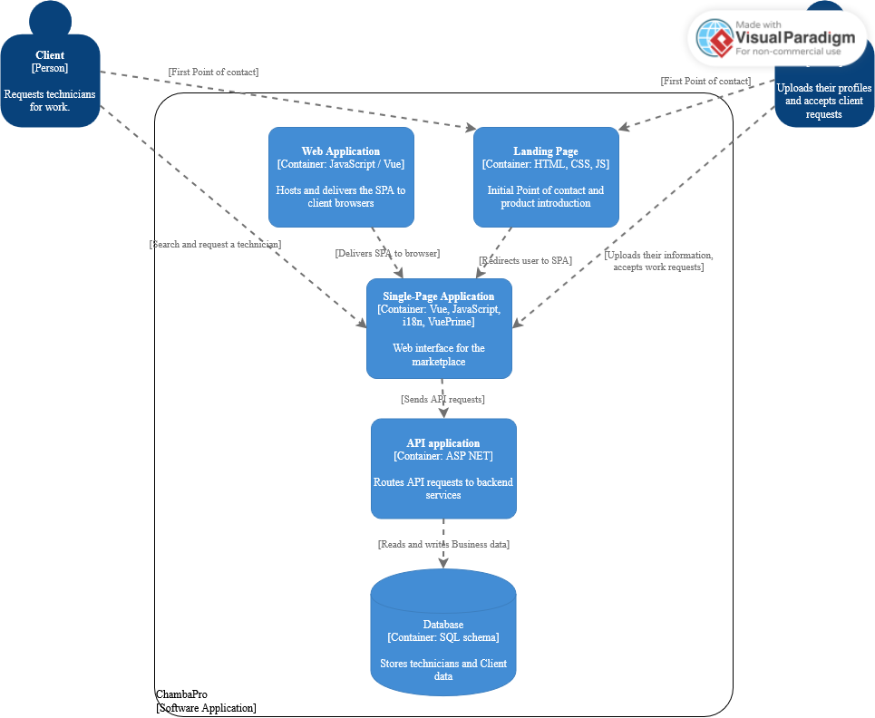

# Capítulo IV: Product Design

## 4.1. Style Guidelines.

### 4.1.1. General Style Guidelines.

#### Tono de Comunicación:

* Profesional y confiable, dirigido a propietarios de viviendas que buscan servicios de calidad.
* Accesible pero competente, para transmitir expertise sin ser intimidante.
* Orientado al servicio, enfocado en resolver problemas y brindar tranquilidad.

#### Tipografía:

* **Inter:** Fuente sans-serif moderna y legible, ideal para interfaces digitales. Usada en el landing page.
* **Hammersmith One:** Fuente sans-serif con un toque de personalidad, utilizada principalmente 
en el front-end de la aplicación web.

#### Colores de Marca: 

* Primario: Azul turquesa (#20B2AA) - Representa confianza y profesionalismo
* Secundario: Gris Claro (#D9D9D9) - Utilizado para elementos interactivos y botones secundarios.
* Neutro: Gris Claro (#f5f5f5) - Utilizados para textos secundarios y fondos.
* Fondo: Blanco (#ffffff) - Limpio y claro, para facilitar la lectura.

#### Paleta de Colores:

| Color         | Hex      | Uso Principal                               |
|---------------|----------|---------------------------------------------|
| Azul Turquesa | #20B2AA  | Elementos interactivos, botones CTA         |
| Gris Claro    | #D9D9D9  | Botones secundarios, elementos interactivos |
| Gris Claro    | #f5f5f5  | Fondos, áreas de contenido                  |
| Blanco        | #ffffff  | Fondos                                      |
| Gris Oscuro   | #2e2e2e  | Textos principales, elementos de contraste  |

#### Spacing y Layout:

* Uso generoso de espacios en blanco para dar claridad visual.
* Secciones bien diferenciadas con márgenes consistentes.
* Cards de equipo con bordes redondeados y sombras suaves.
* Diseño centrado para contenido principal.

### 4.1.2. Web Style Guidelines.

**Responsive Design:** La página es adaptable visualmente a cualquier dispositivo.

#### Componentes Implementados:

* Header: Logo ChambaPro y navegación principal.
* Sección Hero: Título principal, descripción del servicio y botón CTA prominente.
* Cards de equipo: Perfiles profesionales con fotos circulares y nombres.
* Sección de misión y visión: Contenido explicativo sobre valores de la empresa.
* Sección de beneficios: Información sobre valor agregado del servicio.
* Footer: Enlaces secundarios y información legal.

#### Interacciones: 

* Hover sobre botones (cambio de color y efectos sutiles).
* Layout limpio sin mucha carga de imágenes o videos para optimizar tiempos de carga.

## 4.2. Information Architecture.

Se realizó la página basada en órdenes simples y coherentes para propietarios de viviendas 
que buscan servicios de mantenimiento confiables.

Orden lógico de las secciones:
* Hero: Primer impacto visual con propuesta de valor clara.
* Presentación del equipo: Construcción de confianza a través de perfiles profesionales.
* Misión y visión: Establecimiento de credibilidad y valores.
* Beneficios: Refuerzo de la propuesta de valor.
* Contacto: Información para establecer comunicación.

### 4.2.1. Organization Systems.

* Jerárquico: El contenido se organiza desde el impacto inicial hasta el detalle de servicios.
* Centrado en personas: La presentación del equipo es prominente para generar confianza.
* Orientado a beneficios: El mensaje está adaptado a propietarios de viviendas que necesitan 
servicios de mantenimiento.

### 4.2.2. Labeling Systems.

Se representan los datos basados en el sistema de organización detallado anteriormente, buscando simplicidad y claridad para el usuario.

Etiquetas utilizadas en el sitio:
* "Encuentra el Técnico Adecuado para las Necesidades de tu Hogar"
* "Sobre Nosotros"
* "Beneficios"
* "Vision Y Misión"
* "Contacto"
* "Registrarse"

### 4.2.3. SEO Tags and Meta Tags

* **Title:** ChambaPro - Encuentra el Técnico Adecuado para las Necesidades de tu Hogar.
* **Description:** ChambaPro te conecta con técnicos calificados para todas tus necesidades 
de mantenimiento y reparación del hogar. Servicio profesional y confiable en el que puedes confiar.
* **Keywords:** ChambaPro, mantenimiento del hogar, reparación del hogar, técnicos calificados, 
servicios del hogar, técnicos profesionales.
* **Meta Tags:**
  * **Viewport:** width=device-width, initial-scale=1.0
  * **Charset:** UTF-8
* **Author:** WASwarm

### 4.2.4. Searching Systems.

* **Navegación por secciones:** Facilita el acceso a diferentes áreas del sitio mediante la barra 
de navegación superior
* **Búsqueda por perfiles:** Los usuarios pueden revisar los perfiles del equipo para encontrar 
el técnico adecuado
* **Categorización de servicios:** Implícita a través de la presentación del equipo y servicios

### 4.2.5. Navigation Systems.
* **Barra de navegación:** Incluye enlaces a las secciones principales del sitio web, como 
"Sobre Nosotros","Servicios", "Contacto", etc.
* **Botones de llamada a la acción (CTA):** Botones destacados en la sección Hero y en otras
partes del sitio para incentivar a los usuarios a registrarse, iniciar sesión o contactarnos.
* **Footer:** Contiene enlaces adicionales, términos de servicio, contacto y otros.

## 4.3. Landing Page UI Design.

En esta sección, se presentan los diseños de los wireframes y mock-ups de la pagina de inicio de 
chambaPro. Estos diseños son fundamentales para establecer la identidad visual y la experiencia del 
usuario en la plataforma.

### 4.3.1. Landing Page Wireframe.

### 4.3.2. Landing Page Mock-up.

## 4.4. Web Applications UX/UI Design.

### 4.4.1. Web Application Wireframes.

### 4.4.2. Web Applications Wireflow Diagrams.

### 4.4.2. Web Applications Mock-ups.

### 4.4.3. Web Applications User Flow Diagrams.

## 4.5. Web Applications Prototyping.

## 4.6. Domain-Driven Software Architecture.

### 4.6.1. Software Architecture Context Diagram.

En el diagrama de contexto de la arquitectura de software, se ilustra cómo el sistema 
interactúa con Clientes y Técnicos, quienes son los principales actores externos.

### 4.6.2. Software Architecture Container Diagrams.

En el diagrama de contenedores que corresponde al segundo nivel del C4, ofrece una
Descripción más precisa de los componentes técnicos, lo que ayuda a una visión más
amplia de la arquitectura de software.

### 4.6.3. Software Architecture Components Diagrams.

## 4.7. Software Object-Oriented Design.

### 4.7.1. Class Diagrams.

### 4.7.2. Class Dictionary.

## 4.8. Database Design.

### 4.8.1. Database Diagram.