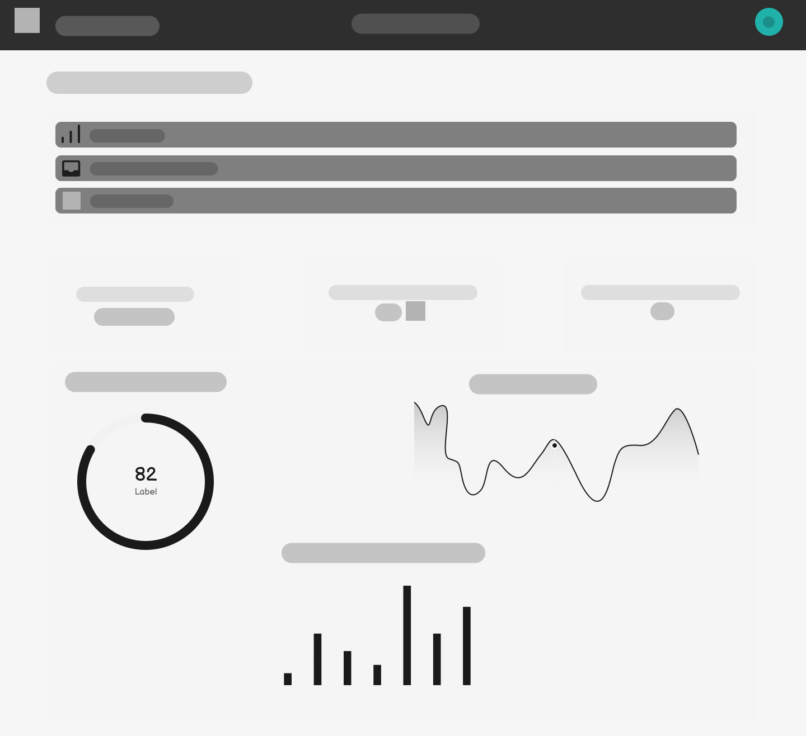
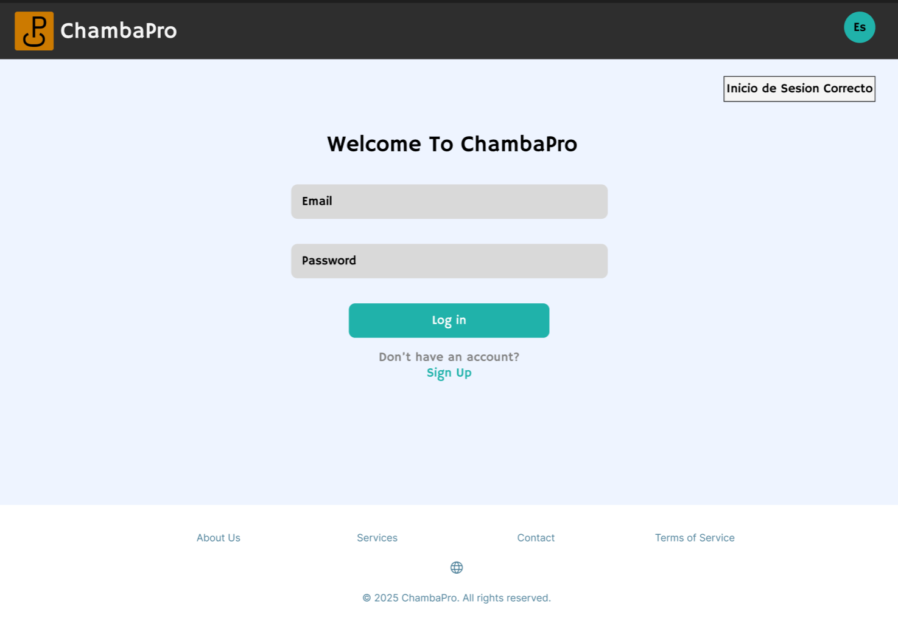
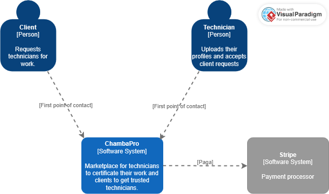

# Capítulo IV: Product Design

## 4.1. Style Guidelines.

### 4.1.1. General Style Guidelines.

#### Tono de Comunicación:

* Profesional y confiable, dirigido a propietarios de viviendas que buscan servicios de calidad.
* Accesible pero competente, para transmitir expertise sin ser intimidante.
* Orientado al servicio, enfocado en resolver problemas y brindar tranquilidad.

#### Tipografía:

* **Inter:** Fuente sans-serif moderna y legible, ideal para interfaces digitales. Usada en el landing page.
* **Hammersmith One:** Fuente sans-serif con un toque de personalidad, utilizada principalmente 
en el front-end de la aplicación web.

#### Colores de Marca: 

* Primario: Azul turquesa (#20B2AA) - Representa confianza y profesionalismo
* Secundario: Gris Claro (#D9D9D9) - Utilizado para elementos interactivos y botones secundarios.
* Neutro: Gris Claro (#f5f5f5) - Utilizados para textos secundarios y fondos.
* Fondo: Blanco (#ffffff) - Limpio y claro, para facilitar la lectura.

#### Paleta de Colores:

| Color         | Hex      | Uso Principal                               |
|---------------|----------|---------------------------------------------|
| Azul Turquesa | #20B2AA  | Elementos interactivos, botones CTA         |
| Gris Claro    | #D9D9D9  | Botones secundarios, elementos interactivos |
| Gris Claro    | #f5f5f5  | Fondos, áreas de contenido                  |
| Blanco        | #ffffff  | Fondos                                      |
| Gris Oscuro   | #2e2e2e  | Textos principales, elementos de contraste  |

#### Spacing y Layout:

* Uso generoso de espacios en blanco para dar claridad visual.
* Secciones bien diferenciadas con márgenes consistentes.
* Cards de equipo con bordes redondeados y sombras suaves.
* Diseño centrado para contenido principal.

### 4.1.2. Web Style Guidelines.

**Responsive Design:** La página es adaptable visualmente a cualquier dispositivo.

#### Componentes Implementados:

* Header: Logo ChambaPro y navegación principal.
* Sección Hero: Título principal, descripción del servicio y botón CTA prominente.
* Cards de equipo: Perfiles profesionales con fotos circulares y nombres.
* Sección de misión y visión: Contenido explicativo sobre valores de la empresa.
* Sección de beneficios: Información sobre valor agregado del servicio.
* Footer: Enlaces secundarios y información legal.

#### Interacciones: 

* Hover sobre botones (cambio de color y efectos sutiles).
* Layout limpio sin mucha carga de imágenes o videos para optimizar tiempos de carga.

## 4.2. Information Architecture.

Se realizó la página basada en órdenes simples y coherentes para propietarios de viviendas 
que buscan servicios de mantenimiento confiables.

Orden lógico de las secciones:
* Hero: Primer impacto visual con propuesta de valor clara.
* Presentación del equipo: Construcción de confianza a través de perfiles profesionales.
* Misión y visión: Establecimiento de credibilidad y valores.
* Beneficios: Refuerzo de la propuesta de valor.
* Contacto: Información para establecer comunicación.

### 4.2.1. Organization Systems.

* Jerárquico: El contenido se organiza desde el impacto inicial hasta el detalle de servicios.
* Centrado en personas: La presentación del equipo es prominente para generar confianza.
* Orientado a beneficios: El mensaje está adaptado a propietarios de viviendas que necesitan 
servicios de mantenimiento.

### 4.2.2. Labeling Systems.

Se representan los datos basados en el sistema de organización detallado anteriormente, buscando simplicidad y claridad para el usuario.

Etiquetas utilizadas en el sitio:
* "Encuentra el Técnico Adecuado para las Necesidades de tu Hogar"
* "Sobre Nosotros"
* "Beneficios"
* "Vision Y Misión"
* "Contacto"
* "Registrarse"

### 4.2.3. SEO Tags and Meta Tags

* **Title:** ChambaPro - Encuentra el Técnico Adecuado para las Necesidades de tu Hogar.
* **Description:** ChambaPro te conecta con técnicos calificados para todas tus necesidades 
de mantenimiento y reparación del hogar. Servicio profesional y confiable en el que puedes confiar.
* **Keywords:** ChambaPro, mantenimiento del hogar, reparación del hogar, técnicos calificados, 
servicios del hogar, técnicos profesionales.
* **Meta Tags:**
  * **Viewport:** width=device-width, initial-scale=1.0
  * **Charset:** UTF-8
* **Author:** WASwarm

### 4.2.4. Searching Systems.

* **Navegación por secciones:** Facilita el acceso a diferentes áreas del sitio mediante la barra 
de navegación superior
* **Búsqueda por perfiles:** Los usuarios pueden revisar los perfiles del equipo para encontrar 
el técnico adecuado
* **Categorización de servicios:** Implícita a través de la presentación del equipo y servicios

### 4.2.5. Navigation Systems.
* **Barra de navegación:** Incluye enlaces a las secciones principales del sitio web, como 
"Sobre Nosotros","Servicios", "Contacto", etc.
* **Botones de llamada a la acción (CTA):** Botones destacados en la sección Hero y en otras
partes del sitio para incentivar a los usuarios a registrarse, iniciar sesión o contactarnos.
* **Footer:** Contiene enlaces adicionales, términos de servicio, contacto y otros.

## 4.3. Landing Page UI Design.

En esta sección, se presentan los diseños de los wireframes y mock-ups de la pagina de inicio de 
chambaPro. Estos diseños son fundamentales para establecer la identidad visual y la experiencia del 
usuario en la plataforma.

### 4.3.1. Landing Page Wireframe.

### 4.3.2. Landing Page Mock-up.

## 4.4. Web Applications UX/UI Design.
El objetivo de esta sección Web Applications UX/UI Design es detallar el enfoque y las estrategias utilizadas en el diseño de la experiencia y la interfaz de usuario para la aplicación web. 
Se busca explicar cómo las decisiones tomadas en términos de diseño visual y funcionalidad contribuyen a mejorar la usabilidad, accesibilidad y satisfacción del usuario final. 
Además, se pretende mostrar cómo estos elementos de diseño ayudan a cumplir los objetivos comerciales del proyecto, asegurando una interacción fluida y eficiente para los usuarios en diferentes dispositivos.
### 4.4.1. Web Application Wireframes.
#### Cliente:
En esta seccion presentamos el wireframe de Historial de Servicio del cliente:

En esta seccion presentamos el wireframe de Busqueda con filtros y seleccion de tecnico:

En esta seccion presentamos el wireframe de Contratacion y revision de reseñas del tecnico:

#### Tecnico:
En esta seccion tenemos el formulario de verficacion del tecnico:

En esta seccion presentamos la agenda de reservaciones del tecnico:

En esta seccion presentamos los graficos estadisticos del tecnico:

### 4.4.2. Web Applications Wireflow Diagrams.

En esta seccion se presenta los wireflow teniendo dos flow:

### 4.4.3. Web Applications Mock-ups.
En esta sección se muestran los mock-ups realizados para nuestro Web Application.

**Login - ChambaPro**       
En esta sección se muestra el diseño del login de la aplicación web, con opciones para iniciar sesión como cliente.

**Sign Up - ChambaPro**        
En esta sección se muestra el diseño del Sign Up de la aplicación web, con opciones para iniciar sesión como cliente.

**Verificacion de Tecnicos**               
En esta sección se muestra el diseño de la verificacion de la aplicación web, con opciones para ingresar datos como los nombres, apellidos, email, Documento de indentidad(DNI), telefono, razon social, RUC, ademas la opcion de dejar marcado las zonas de trabajo preferidas y su categoria y empecialidad que desempeñe como tecnico.

**Buscar Tecnico**   
En esta seccion se muestra una de las partes mas fundamentales de la aplicacion web, con opciones para poder buscar y filtrar la busqueda por servicio especifico, nombre del tecnico y por ubicacion.
Ademas se puede observar previamente el perfil del tecnico, su especialidad, cantidad de reseñas y un parrafo de presentacion donde cuenta su experiencia y sus servicios.

**Historial de Servicios**  
En esta sección se muestra el historial de servicios realizados, con la opción de ver detalles de cada fecha, tecnico, el costo del mismo y el estado de este.

**Perfil del Tecnico**        
En esta seccion se muestra el perfil del tecnico mas las reseñas que dejan los clientes, con la opción de dejar tu reseña y de poder contratar al tecnico con un CTA.

**Agenda de Reservaciones**     
En esta sección se muestra el diseño de la Agenda de Reservaciones de la aplicación web, con opcion de visualizar una agenda en filas que dice las fechas que tiene un trabajo especifico que tiene como tecnico.

**Panel de Estadisticas**              
En esta sección se muestra el diseño del panel de estadisticas de la aplicación web, con opcion de visualizar 3 tipos de graficos, lo cuales son los ingresos totales, la calificaion promedio, servicios completados como tecnico.

### 4.4.4. Web Applications User Flow Diagrams.

## 4.5. Web Applications Prototyping.

## 4.6. Domain-Driven Software Architecture.

### 4.6.1. Software Architecture Context Diagram.

En el diagrama de contexto de la arquitectura de software, se ilustra cómo el sistema 
interactúa con Clientes y Técnicos, quienes son los principales actores externos.

### 4.6.2. Software Architecture Container Diagrams.

En el diagrama de contenedores que corresponde al segundo nivel del C4, ofrece una
Descripción más precisa de los componentes técnicos, lo que ayuda a una visión más
amplia de la arquitectura de software.

### 4.6.3. Software Architecture Components Diagrams.

A continuación, se mostrarán los diagramas de componentes para cada Bounded Context, junto con detalles 
sobre las tecnologías utilizadas e implementaciones específicas.

Diagrama de componente de lista de trabajos:

Diagrama de componente de manejo de usuarios:

Diagrama de componente de analiticas:

## 4.7. Software Object-Oriented Design.

### 4.7.1. Class Diagrams.

Aquí se presenta el diagrama de clases de ChambaPro. Este diagrama ilustra las entidades y sus relaciones, proporcionando una visión clara de la estructura del software.

### 4.7.2. Class Dictionary.

A continuación, se presenta un diccionario de clases que describe las entidades y sus atributos, así como los métodos asociados a cada una.

### Usuario (clase padre)
**Atributos:**
- idUsuario: int
- nombre: string
- apellido: string
- email: string
- telefono: string
- direccion: string
- contraseña: string

**Métodos:**
- registrar()
- iniciarSesion()
- cerrarSesion()
- editarPerfil()

---

### Cliente (hereda de Usuario)
**Atributos:**
- metodoPagoPreferido: string
- historialContrataciones: List<Contratacion>

**Métodos:**
- buscarServicio()
- contratarTecnico(tecnico: Tecnico, servicio: Servicio)
- calificarServicio(contratacion: Contratacion, puntaje: int, comentario: string)

---

### Técnico (hereda de Usuario)
**Atributos:**
- especialidad: string
- experiencia: string
- tarifaPorHora: double
- disponibilidad: string
- historialServicios: List<Contratacion>

**Métodos:**
- ofrecerServicio(servicio: Servicio)
- actualizarDisponibilidad()
- aceptarContratacion(contratacion: Contratacion)

---

### Servicio
**Atributos:**
- idServicio: int
- nombre: string
- descripcion: string
- precioBase: double

**Métodos:**
- mostrarDetalle()
- actualizarPrecio(nuevoPrecio: double)

---

### Contratacion
**Atributos:**
- idContratacion: int
- cliente: Cliente
- tecnico: Tecnico
- servicio: Servicio
- fecha: Date
- estado: string
- montoTotal: double

**Métodos:**
- actualizarEstado(nuevoEstado: string)
- calcularMonto()

---

### Chat
**Atributos:**
- idChat: int
- participantes: List<Usuario>
- mensajes: List<Mensaje>

**Métodos:**
- enviarMensaje(usuario: Usuario, texto: string)
- mostrarHistorial()

---

### Mensaje
**Atributos:**
- idMensaje: int
- remitente: Usuario
- contenido: string
- fechaEnvio: Date

**Métodos:**
- editarMensaje(nuevoContenido: string)
- eliminarMensaje()

---

### Pago
**Atributos:**
- idPago: int
- contratacion: Contratacion
- monto: double
-metodo: string
- fechaPago: Date
- estado: string

**Métodos:**
- procesarPago()
- validarPago()
- reembolsar()

## 4.8. Database Design.

### 4.8.1. Database Diagram.

