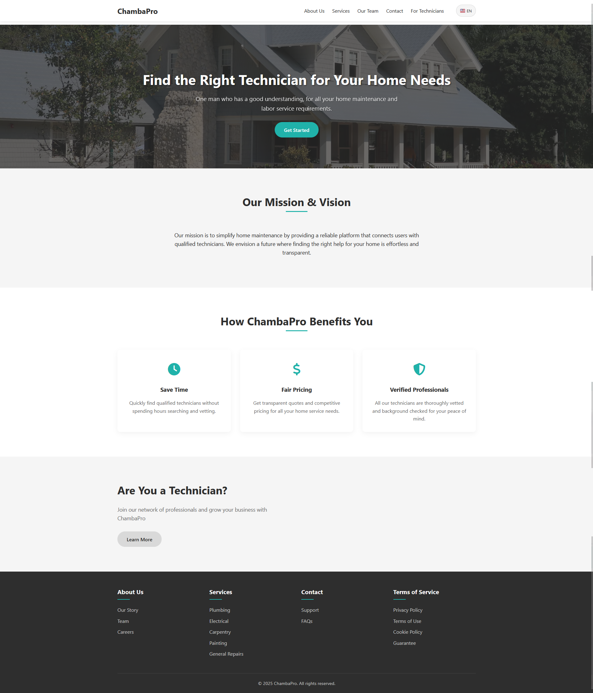
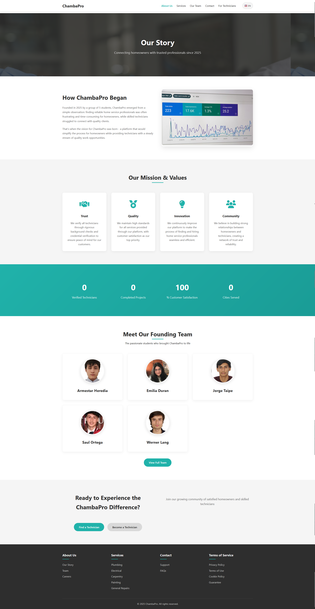
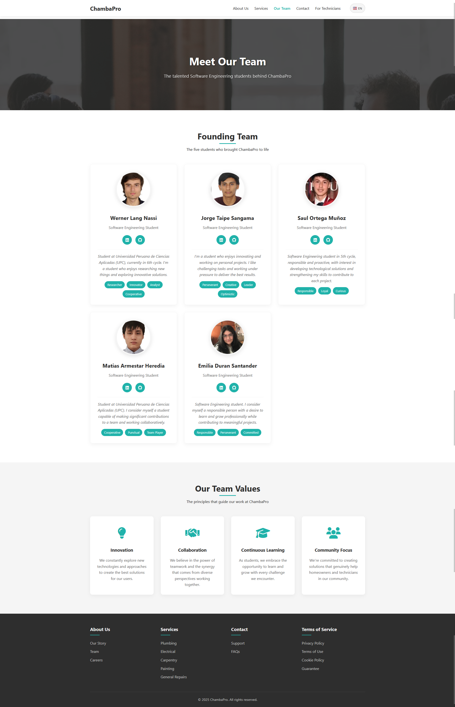
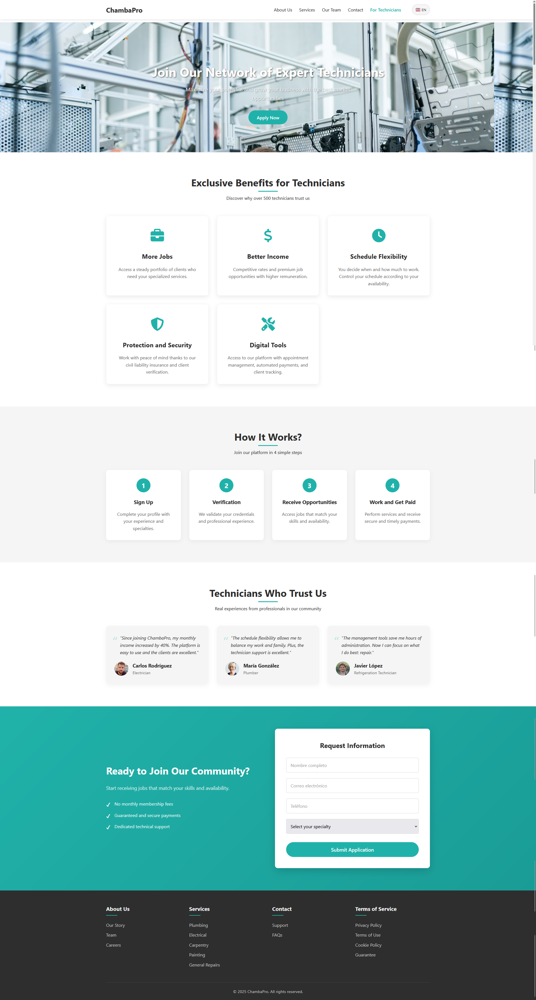
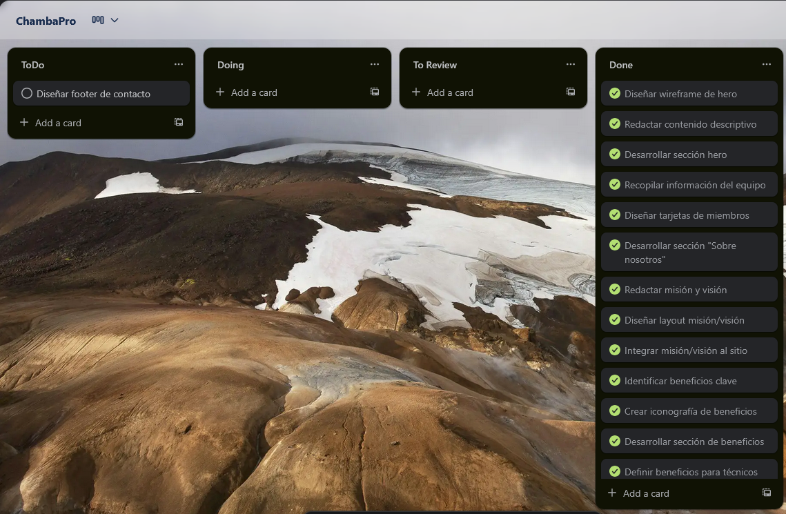
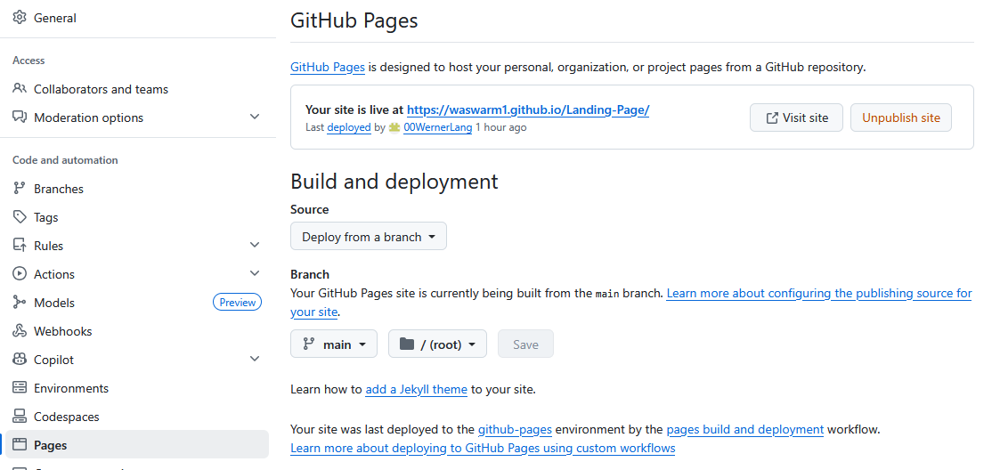
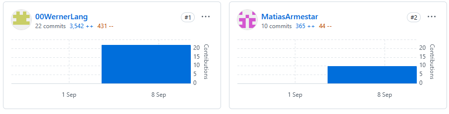

# Capítulo V: Product Implementation, Validation & Deployment

## 5.1. Software Configuration Management.

En esta sección se describen las herramientas y configuraciones utilizadas para gestionar el desarrollo del software, 
incluyendo el entorno de desarrollo, el control de versiones, las convenciones de estilo de código y la configuración del despliegue.

### 5.1.1. Software Development Environment Configuration.

En esta sección, se incluirá los productos de software que se usaron en el proyecto. Los enlaces a cada una de las 
herramientas se encuentran disponibles en los anexos.

#### Project Management:

* Trello: Herramienta de gestión de proyectos basada en tableros Kanban. Permite organizar tareas, asignar 
responsabilidades y hacer seguimiento del progreso del proyecto.

#### Product UX/UI Design:

* Figma: Herramienta de diseño colaborativo para crear prototipos, wireframes y diseños de interfaces de usuario.
* Uxpressia: Plataforma para crear mapas de experiencia de usuario, customer journey maps y user personas.
* Visual Paradigm: Herramienta de modelado UML y diseño de software.

#### Software Development:

* Rider: Entorno de desarrollo integrado (IDE) para .NET y C#.
* Webstorm: IDE para desarrollo web, soporta HTML, CSS, JavaScript y frameworks modernos.
* GitHub: Plataforma de alojamiento de código fuente y control de versiones utilizando Git.
* Visual Studio Code: Editor utilizado únicamente para la exportación del reporte de formato markdown a PDF.

#### Software Deployment:

* GitHub Pages: Servicio de alojamiento web estático proporcionado por GitHub, ideal para desplegar sitios web y documentación.
* Netlify: Plataforma de despliegue y alojamiento para sitios web estáticos y aplicaciones web modernas.

### 5.1.2. Source Code Management.

Para la gestion del código fuente se utilizó GitHub, una plataforma de alojamiento de código fuente y control de versiones utilizando Git.
Se creó un repositorio en la organización de GitHub, donde se almacenó todo el código fuente del proyecto. 
El repositorio se estructuró de la siguiente manera:

* Organización en Github: https://github.com/WASwarm1
* Repositorio del informe final: https://github.com/WASwarm1/final-report
* Repositorio de la Landing Page: https://github.com/WASwarm1/Landing-Page

#### Modelo de ramificación: GitFlow

Se utilizó el modelo de ramificación GitFlow, el cual permite una gestión eficiente del desarrollo mediante ramas específicas para diferentes propósitos.

Para el repositorio del informe final, se utilizó la siguiente estructura de ramas:

* `main`: Rama principal que contiene la versión estable del informe.
* `develop`: Rama de desarrollo donde se integran todas las características antes de ser fusionadas a `main`.
* `chapter1`: Rama para el desarrollo del Capítulo I.
* `chapter2`: Rama para el desarrollo del Capítulo II.
* `chapter3`: Rama para el desarrollo del Capítulo III.
* `chapter4`: Rama para el desarrollo del Capítulo IV.
* `chapter5`: Rama para el desarrollo del Capítulo V.

Para el repositorio de la Landing Page, se utilizó la siguiente estructura de ramas:

* `main`: Rama principal que contiene la versión estable de la landing page.

#### Estilo de commits: Conventional Commits

Se adoptó la convención de commits "Conventional Commits" para mantener un historial de cambios claro y consistente.
Los tipos de commits utilizados incluyen:

* `feat`: Para nuevas características o funcionalidades.
* `fix`: Para correcciones de errores.
* `docs`: Para cambios en la documentación.
* `refactor`: Para cambios en el código que no agregan ni corrigen funcionalidades.

El prefijo de categoría se define de la siguiente forma:

* `feat`: A new feature
* `fix`: A bug fix
* `docs`: Documentation only changes
* `style`: Changes that do not affect the meaning of the code (white-space, formatting, missing semi-colons, etc)
* `refactor`: A code change that neither fixes a bug nor adds a feature
* `test`: Adding missing tests or correcting existing tests
* `chore`: Changes to the build process or auxiliary tools and libraries such as documentation generation

### 5.1.3. Source Code Style Guide & Conventions.

Se adoptaron las siguientes guías y convenciones de estilo de código para asegurar la calidad y consistencia del código fuente, el idioma
estándar para el desarrollo fue el **inglés**.

#### Principios generales:

* **Idioma estándar**: Inglés
* **Legibilidad ante todo**: El código debe ser fácil de leer y entender.
* **Consistencia**: Seguir las mismas convenciones en todo el proyecto.
* **Nombres semánticos**: Utilizar nombres descriptivos para variables, funciones y clases. 
Se usan **sustantivos** para clases y **verbos** para funciones.
* **Indentación**: Usar 2 espacios para la indentación de HTML, CSS, JS y TS. 4 espacios para C#.

#### HTML y CSS:

#### HTML:

* Archivos HTML deben tener la extensión `.html`.
* Se incluye `alt` en todas las imágenes.
* Usar comillas dobles para atributos.
* Usar etiquetas semánticas (`<header>`, `<nav>`, `<main>`, `<footer>`, etc.).
* Indentación de 2 espacios.

#### CSS:

* Archivos CSS deben tener la extensión `.css`.
* Usar guiones para nombres de clases y IDs (e.g., `.main-header`).
* Se agrupan estilos relacionados y se separan con comentarios.

#### JavaScript y TypeScript:

* Archivos JS deben tener la extensión `.js` y TS `.ts`.
* Usar camelCase para nombres de variables y funciones.
* Usar `PascalCase` para nombres de clases y componentes: `MyComponent`, `UserProfile`.
* Usar `const` y `let` en lugar de `var`.
* Usar funciones flecha y nombres explícitos.
* Los archivos deben tener una unica responsabilidad (Single Responsibility Principle).

#### C#:

* Archivos C# deben tener la extensión `.cs`.
* Usar `PascalCase` para nombres de clases, métodos y propiedades.
* Usar `camelCase` para nombres de variables y parámetros.
* Indentación de 4 espacios.

### 5.1.4. Software Deployment Configuration.

En esta sección se describen las configuraciones y herramientas utilizadas para el despliegue del software desarrollado.
El objetivo es asegurar que el proceso de despliegue sea eficiente, automatizado y confiable.

#### Despliegue de la Landing Page:

La **Landing Page** fue desarrollada utilizando tecnologías web estándar como HTML, CSS y JavaScript. Y fue desplegada utilizando **GitHub Pages**, 
un servicio de alojamiento web estático proporcionado por GitHub.

#### Pasos para el despliegue:

1. **Creación del repositorio**: Se creó un repositorio en la organización de GitHub llamado `Landing-Page`.
2. **Desarrollo del sitio**: El código fuente de la landing page se desarrolló y organizó en el repositorio.
3. **Configuración de GitHub Pages**: En la configuración del repositorio, se habilitó GitHub Pages seleccionando la rama `main` como fuente.
4. **Despliegue automático**: Cada vez que se realiza un push a la rama `main`, GitHub Pages actualiza automáticamente el sitio web.

**Repositorio de la Landing Page**: https://github.com/WASwarm1/Landing-Page
**URL de la Landing Page desplegada**: https://waswarm1.github.io/Landing-Page/

## 5.2. Landing Page, Services & Applications Implementation.

En esta sección se detalla la implementación de todos los estables de ChambaPro.

#### Landing Page:

La landing page fue desarrollada utilizando HTML, CSS y JavaScript; y fue diseñada para ser responsiva y adaptarse a diferentes dispositivos.
El diseño se basó en los wireframes y mock-ups creados durante la fase de diseño UX/UI y fue desplegada utilizando GitHub Pages.

La landing page incluye las siguientes secciones principales:
* Home: Sección principal con una descripción del producto y un llamado a la acción.

* About Us: Información sobre el equipo fundador, misión y visión.

* Our Team: Presentación de los miembros del equipo con sus roles y biografías.

* For Technicians: Beneficios y características para profesionales técnicos.

### 5.2.1. Sprint 1

#### 5.2.1.1. Sprint Planning 1.

<table>
<tr>
    <th colspan="5">Sprint 1</th>
    <th colspan="9">Sprint 1</th>
  </tr>
      <tr>
    <td colspan="13">Sprint Planning Background</td>
  </tr>
  <tr>
    <td colspan="5">Date</td>
    <td colspan="8">2025-09-10</td>
</tr>
  <tr>
    <td colspan="5">Time</td>
    <td colspan="8">21:30</td>
  </tr>
  <tr>
    <td colspan="5">Location</td>
    <td colspan="8">via Google Meets</td>
<tr>
    <td colspan="5">Prepared By</td>
    <td colspan="8">Werner Lang</td>
</tr>
<tr>
    <td colspan="5">Attendees (to planning meeting)</td>
    <td colspan="8">Werner Khalil Lang Nassi, Jorge Francisco Taipe Sangama, Saúl Ortega Muñoz, Matias Gabriel Armestar Heredia, Emilia Duran Santander</td>
</tr>
<tr>
    <td colspan="5">Sprint  1 Review Summary</td>
    <td colspan="8">En este primer sprint se asignaron responsabilidades a cada integrante y planteo los requerimientos para el desarrollo de la Landing Page.</td>
</tr>
<tr>
    <td colspan="5">Sprint 1 Retrospective Summary</td>
    <td colspan="8">En esta sección todos los integrantes mencionaron tener aciertos en partes del codigo y en otras partes poder mejorar sus habilidades realizando la Landing Page</td>
</tr>
<tr>
    <td colspan="13">Sprint Goal & User Stories</td>
</tr>
<tr>
    <td colspan="5">Sprint 1 Goal</td>
    <td colspan="8">
Desarollar y desplegar una lading con la finalidad de presentar información relevante a los usuarios a través de imágenes.
La página debe ser completamente adaptable a todos los dispositivos que puedan utilizar los usuarios, asegurando una experiencia
fluida y responsiva.</td>
</tr>
</table>

#### 5.2.1.2. Aspect Leaders and Collaborators.

| Team member (LastName, First Name) | GitHub UserName | Aspect 1: Landing Page Leader (L) / Collaborator (C) | Aspect 2: Diseños Figma: Leader (L) / Collaborator (C) | Aspect 3: Reporte (L) / Collaborator (C) |
|------------------------------------|-----------------|------------------------------------------------------|--------------------------------------------------------|------------------------------------------|
| Lang Nassi, Werner Khalil          | 00WernerLang    | L                                                    | C                                                      | L                                        |
| Jorge Franciscoz Taipe Sangama     | CamotinFurious  | C                                                    | L                                                      | L                                        |
| Ortega Muñoz, Saúl                 | Ss1lent10       | C                                                    | L                                                      | C                                        |
| Armestar Heredia, Matias Gabriel   | MatiasArmestar  | L                                                    | C                                                      | L                                        |
| Duran Santander, Emilia            | emiliadurans    | C                                                    | L                                                      | C                                        |

#### 5.2.1.3. Sprint Backlog 1.

|  Sprint 1  |            Sprint 1             |     |                                      |                                                                      |                    |                  |                                                |
|:----------:|:-------------------------------:|:---:|:------------------------------------:|:--------------------------------------------------------------------:|:------------------:|:----------------:|:----------------------------------------------:|
| User Story |        Work-Item / Task         |     |                                      |                                                                      |                    |                  |                                                |
|     Id     |              Title              | Id  |                Title                 |                             Description                              | Estimation (Hours) |   Assigned To    | Status (To do / In process / To review / Done) |
|    US01    |  Ver descripción del producto   | W01 |      Diseñar wireframe de hero       | Crear wireframe de la sección principal con descripción del producto |         2          |   Werner Lang    |                      Done                      |
|            |                                 | W02 |  Redactar contenido descriptivo      |       Escribir textos claros sobre funcionalidad y beneficios        |         3          |   Werner Lang    |                      Done                      |
|            |                                 | W03 |       Desarrollar sección hero       |       Maquetar y codificar la sección principal de la landing        |         4          |   Werner Lang    |                      Done                      |
|    US02    |   Conocer al equipo fundador    | W04 |   Recopilar información del equipo   |      Obtener fotos, nombres, roles y biografías de cada miembro      |         1          |   Werner Lang    |                      Done                      |
|            |                                 | W05 |     Diseñar tarjetas de miembros     |        Crear diseño de las tarjetas para mostrar información         |         2          |   Werner Lang    |                      Done                      |
|            |                                 | W06 | Desarrollar sección "Sobre nosotros" |        Implementar página completa con información del equipo        |         3          |   Werner Lang    |                      Done                      |
|    US03    |      Ver misión y visión        | W07 |       Redactar misión y visión       |          Definir y escribir la misión y visión de ChambaPro          |         2          |   Werner Lang    |                      Done                      |
|            |                                 | W08 |     Diseñar layout misión/visión     |          Crear diseño visual para presentar misión y visión          |         1          |   Werner Lang    |                      Done                      |
|            |                                 | W09 |   Integrar misión/visión al sitio    |            Implementar sección dentro de "Sobre nosotros"            |         2          |   Werner Lang    |                      Done                      |
|    US04    |  Ver beneficios para clientes   | W10 |     Identificar beneficios clave     |       Listar y priorizar beneficios principales para clientes        |         1          |   Werner Lang    |                      Done                      |
|            |                                 | W11 |   Crear iconografía de beneficios    |          Diseñar íconos representativos para cada beneficio          |         2          |   Werner Lang    |                      Done                      |
|            |                                 | W12 |  Desarrollar sección de beneficios   |       Implementar sección visual con beneficios para clientes        |         3          |   Werner Lang    |                      Done                      |
|    US05    |  Ver beneficios para técnicos   | W13 |   Definir beneficios para técnicos   |       Especificar ventajas únicas para profesionales técnicos        |         1          |   Werner Lang    |                      Done                      |
|            |                                 | W14 |    Diseñar sección para técnicos     |       Crear layout específico para mostrar beneficios técnicos       |         2          |   Werner Lang    |                      Done                      |
|            |                                 | W15 |   Implementar beneficios técnicos    |       Desarrollar sección completa para profesionales técnicos       |         3          |   Werner Lang    |                      Done                      |
|    US06    |     Ver botón de registro       | W16 |     Diseñar botón call-to-action     |        Crear diseño atractivo del botón de registro principal        |         1          |   Werner Lang    |                      Done                      |
|            |                                 | W17 |  Configurar redirección de registro  |         Implementar navegación hacia formulario de registro          |         1          |   Werner Lang    |                      Done                      |
|            |                                 | W18 |      Integrar botón en cabecera      |          Posicionar y maquetar botón en hero de la landing           |         1          |   Werner Lang    |                      Done                      |
|    US07    |     Ver botón de contacto       | W19 |    Recopilar información contacto    |       Definir canales de contacto: email, teléfono, formulario       |         1          | Matais Armestar  |                      Done                      |
|            |                                 | W20 |      Diseñar footer de contacto      |      Crear diseño del pie de página con información de contacto      |         2          | Matais Armestar  |                      Done                      |
|            |                                 | W21 |   Desarrollar sección de contacto    |    Implementar footer completo con todos los enlaces adicionales     |         2          |   Werner Lang    |                      Done                      |
#### 5.2.1.4. Development Evidence for Sprint Review.

En esta sección se demuestran los commits relacionados con los principales avances en la implementación. 
Estos commits provienen del repositorio de la landing de la organización de GitHub.

Enlace al repositorio de la Landing Page: https://github.com/WASwarm1/Landing-Page

| Repository           | Branch | Commit Id | Commit Message                      | Commit Message Body | Commited on (Date) |
|----------------------|--------|-----------|-------------------------------------|---------------------|--------------------|
| WASwarm/Landing-Page | main   | c612997   | fix: Logo color                     |                     | 9/9/2025           |
| WASwarm/Landing-Page | main   | 996ddc5   | feat(landing): add technicians page |                     | 10/9/2025          |
| WASwarm/Landing-Page | main   | 0ba8c74   | feat(landing): add about us page    |                     | 10/9/2025          |
| WASwarm/Landing-Page | main   | 7a5a95e   | feat(landing): add our team page    |                     | 10/9/2025          |
| WASwarm/Landing-Page | main   | 52d97f6   | fix: add i18n for terms             |                     | 10/9/2025          |
| WASwarm/Landing-Page | main   | 44a5e9e   | feat(landing): add services html    |                     | 11/9/2025          |
| WASwarm/Landing-Page | main   | bf1eabf   | feat(landing): add contact html     |                     | 11/9/2025          |

#### 5.2.1.5. Execution Evidence for Sprint Review.

Este sprint estuvo únicamente enfocado en el desarrollo de la Landing Page.
La landing page fue desarrollada utilizando HTML, CSS y JavaScript; y fue diseñada para ser responsiva y adaptarse a diferentes dispositivos.
El diseño se basó en los wireframes y mock-ups creados durante la fase de diseño UX/UI y fue desplegada utilizando GitHub Pages.

#### 5.2.1.6. Services Documentation Evidence for Sprint Review.

Debido a que el sprint estuvo únicamente enfocado en el desarrollo de la Landing Page, no se desarrollaron servicios adicionales.
Aunque no se implementaron servicios en este sprint, la landing page sirve como una plataforma informativa crucial para atraer y convertir usuarios potenciales.
El desarrollo de servicios backend y funcionalidades adicionales está planificado para futuros sprints, donde se detallará la documentación correspondiente.

#### 5.2.1.7. Software Deployment Evidence for Sprint Review.

La landing page fue desplegada utilizando **GitHub Pages**, un servicio de alojamiento web estático proporcionado por GitHub.
El proceso de despliegue fue el siguiente:

1. **Creación del repositorio**: Se creó un repositorio en la organización de GitHub: https://github.com/WASwarm1/Landing-Page
2. **Desarrollo del sitio**: El código fuente de la landing page se desarrolló y organizó en el repositorio.
3. **Configuración de GitHub Pages**: En la configuración del repositorio, se habilitó GitHub Pages seleccionando la rama `main` como fuente.
4. **Verificación del despliegue**: Se verificó que la landing page estuviera accesible públicamente y funcionara correctamente 
en diferentes dispositivos y navegadores en la siguiente URL: 

**Landing Page desplegada:** https://waswarm1.github.io/Landing-Page/

#### Evidencia de despliegue:

#### 5.2.1.8. Team Collaboration Insights during Sprint.

En esta sección se presentan las evidencias de colaboración del equipo durante el sprint 1 para el desarrollo de la landing page.

Cada miembro del equipo tuvo roles específicos, pero todos colaboraron en la planificación, desarrollo y revisión del trabajo.
A continuación, se muestran algunos insights del repositorio de GitHub:

* **Werner Lang:** Implementó el home, about us, our team, for technicians, terms, footer y header.
* **Matias Armestar:** Se encargó de la página de contact y services.

### 5.2.2. Sprint 2

#### 5.2.2.1. Sprint Planning 2.

<table>
<tr>
    <th colspan="5">Sprint 2</th>
    <th colspan="9">Sprint 2</th>
  </tr>
      <tr>
    <td colspan="13">Sprint Planning Background</td>
  </tr>
  <tr>
    <td colspan="5">Date</td>
    <td colspan="8">2025-10-01</td>
</tr>
  <tr>
    <td colspan="5">Time</td>
    <td colspan="8">14:40</td>
  </tr>
  <tr>
    <td colspan="5">Location</td>
    <td colspan="8">via WhatsApp</td>
<tr>
    <td colspan="5">Prepared By</td>
    <td colspan="8">Werner Lang</td>
</tr>
<tr>
    <td colspan="5">Attendees (to planning meeting)</td>
    <td colspan="8">Werner Khalil Lang Nassi, Jorge Francisco Taipe Sangama, Saúl Ortega Muñoz, Matias Gabriel Armestar Heredia, Emilia Duran Santander</td>
</tr>
<tr>
    <td colspan="5">Sprint  2 Review Summary</td>
    <td colspan="8">-</td>
</tr>
<tr>
    <td colspan="5">Sprint 2 Retrospective Summary</td>
    <td colspan="8">-</td>
</tr>
<tr>
    <td colspan="13">Sprint Goal & User Stories</td>
</tr>
<tr>
    <td colspan="5">Sprint 2 Goal</td>
    <td colspan="8">
-</td>
</tr>
</table>

#### 5.2.2.2. Aspect Leaders and Collaborators.

| Team member (LastName, First Name) | GitHub UserName | Aspect 1: User | Aspect 2: Work | Aspect 3: Reporte |
|------------------------------------|-----------------|----------------|----------------|-------------------|
| Lang Nassi, Werner Khalil          | 00WernerLang    | C              | L              | L                 |
| Jorge Franciscoz Taipe Sangama     | CamotinFurious  | L              | C              | C                 |
| Ortega Muñoz, Saúl                 | Ss1lent10       | C              | L              | C                 |
| Armestar Heredia, Matias Gabriel   | MatiasArmestar  | L              | C              | C                 |
| Duran Santander, Emilia            | emiliadurans    | C              | L              | C                 |

#### 5.2.2.3. Sprint Backlog 2.

| User Story |           Work-Item / Task           |  Id | Title                             | Description                                                       | Estimation (Hours) | Assigned To | Status |
| :--------: | :----------------------------------: | :-: | :-------------------------------- | :---------------------------------------------------------------- | :----------------: | :---------: | :----: |
|  **US08**  |          Registro de usuario         | T01 | Diseño del formulario de registro | Crear interfaz con campos de nombre, correo y contraseña.         |          6         |             |  To do |
|            |                                      | T02 | Validaciones y mensajes           | Implementar validaciones de campos y mensajes de error/exito.     |          4         |             |  To do |
|            |                                      | T03 | Pruebas de registro               | Verificar flujo de registro exitoso y fallido (correo repetido).  |          4         |             |  To do |
|  **US09**  |           Inicio de sesión           | T04 | Diseño del formulario de login    | Crear interfaz con campos de correo y contraseña.                 |          4         |             |  To do |
|            |                                      | T05 | Manejo de sesión                  | Guardar sesión (token) y redirigir al panel principal.            |          5         |             |  To do |
|            |                                      | T06 | Pruebas de login                  | Validar mensajes de error y éxito.                                |          3         |             |  To do |
|  **US10**  |        Historial de servicios        | T07 | Diseño de tabla de historial      | Mostrar lista de servicios con fecha, técnico, costo y estado.    |          6         |             |  To do |
|            |                                      | T08 | Filtros de historial              | Agregar búsqueda y filtrado por fecha o estado.                   |          5         |             |  To do |
|            |                                      | T09 | Pruebas del historial             | Validar visualización y actualización de datos.                   |          4         |             |  To do |
|  **US11**  |           Agenda / Reservas          | T10 | Diseño de calendario              | Implementar vista de calendario con reservas confirmadas.         |          6         |             |  To do |
|            |                                      | T11 | Colores y estados visuales        | Mostrar servicios por estado (confirmado, pendiente, etc.).       |          4         |             |  To do |
|            |                                      | T12 | Pruebas de agenda                 | Validar visualización correcta de citas.                          |          3         |             |  To do |
|  **US12**  |         Panel de estadísticas        | T13 | Diseño del panel de métricas      | Crear gráficos (ingresos, calificaciones, servicios completados). |          8         |             |  To do |
|            |                                      | T14 | Integración con datos             | Conectar componentes de gráficos a API existente.                 |          5         |             |  To do |
|            |                                      | T15 | Pruebas de estadísticas           | Validar precisión de los datos mostrados.                         |          4         |             |  To do |
|  **US13**  | Verificación de identidad de técnico | T16 | Formulario de verificación        | Interfaz para subir documentos (DNI, certificaciones, fotos).     |          6         |             |  To do |
|            |                                      | T17 | Estado de verificación            | Mostrar estado: pendiente, aprobado, rechazado.                   |          4         |             |  To do |
|            |                                      | T18 | Pruebas de verificación           | Validar flujo de subida y estado visual.                          |          4         |             |  To do |
|  **US14**  |     Filtrado por tipo de servicio    | T19 | Diseño de filtros por categoría   | Mostrar lista de categorías con checkboxes o dropdown.            |          4         |             |  To do |
|            |                                      | T20 | Actualización dinámica            | Actualizar resultados según categoría seleccionada.               |          5         |             |  To do |
|            |                                      | T21 | Pruebas de filtrado               | Verificar respuesta y visualización correcta.                     |          3         |             |  To do |
|  **US15**  |         Filtrado por técnico         | T22 | Barra de búsqueda por nombre      | Campo de texto para buscar técnicos por nombre.                   |          4         |             |  To do |
|            |                                      | T23 | Resultados de búsqueda            | Mostrar lista filtrada de técnicos coincidentes.                  |          4         |             |  To do |
|            |                                      | T24 | Pruebas de búsqueda               | Verificar coincidencias y mensajes de “no encontrado”.            |          3         |             |  To do |
|  **US16**  |          Filtros combinados          | T25 | Diseño de búsqueda avanzada       | Interfaz que combine categoría + ubicación.                       |          6         |             |  To do |
|            |                                      | T26 | Aplicación de múltiples filtros   | Mostrar solo técnicos que cumplen todos los criterios.            |          5         |             |  To do |
|            |                                      | T27 | Pruebas de búsqueda avanzada      | Validar combinaciones de filtros.                                 |          4         |             |  To do |
|  **US17**  |           Visualizar perfil          | T28 | Diseño de perfil de técnico       | Mostrar foto, experiencia, certificaciones, servicios.            |          6         |             |  To do |
|            |                                      | T29 | Integración con reseñas y datos   | Mostrar reseñas y calificaciones del técnico.                     |          5         |             |  To do |
|            |                                      | T30 | Pruebas del perfil                | Validar carga completa de información.                            |          3         |             |  To do |
|  **US18**  |          Reseñas de clientes         | T31 | Diseño de formulario de reseña    | Interfaz con campo de texto y estrellas.                          |          4         |             |  To do |
|            |                                      | T32 | Publicación de reseña             | Actualizar lista de reseñas sin recargar página.                  |          4         |             |  To do |
|            |                                      | T33 | Pruebas de reseñas                | Validar flujo de envío y actualización.                           |          3         |             |  To do |
|  **US19**  |            Métodos de pago           | T34 | Pantalla de selección de pago     | Interfaz para elegir entre tarjeta o billetera digital.           |          5         |             |  To do |
|            |                                      | T35 | Validaciones de formulario        | Validar campos de tarjeta, monto y tipo de pago.                  |          4         |             |  To do |
|            |                                      | T36 | Pruebas de pago                   | Simular selección de método y confirmación.                       |          4         |             |  To do |
|  **US20**  |         Confirmación de pago         | T37 | Pantalla de confirmación          | Mostrar mensaje de éxito o error según estado del pago.           |          4         |             |  To do |
|            |                                      | T38 | Envío de comprobante              | Interfaz para mostrar comprobante o permitir descarga.            |          4         |             |  To do |
|            |                                      | T39 | Pruebas de confirmación           | Validar mensajes y flujo completo de pago.                        |          3         |             |  To do |

#### 5.2.2.4. Development Evidence for Sprint Review.

#### 5.2.2.5. Execution Evidence for Sprint Review.

#### 5.2.2.6. Services Documentation Evidence for Sprint Review.

#### 5.2.2.7. Software Deployment Evidence for Sprint Review.

#### 5.2.2.8. Team Collaboration Insights during Sprint.

## 5.3. Validation Interviews.

### 5.3.1. Diseño de Entrevistas.

### 5.3.2. Registro de Entrevistas.

### 5.3.3. Evaluaciones según heurísticas.

## 5.4. Video About-the-Product.

## Conclusiones.

### Conclusiones Y Recomendaciones.

### Video About-the-Team.

## Bibliografía.

## Anexos.

### VIDEOS:

| Título                  | Descripción                                      | Enlace                                                                                                                                                                                                                                                                                                                                                                                                                                                  |
|-------------------------|--------------------------------------------------|---------------------------------------------------------------------------------------------------------------------------------------------------------------------------------------------------------------------------------------------------------------------------------------------------------------------------------------------------------------------------------------------------------------------------------------------------------|
| Video de exposición TB1 |                                                  | https://acortar.link/YlsZmz                                                                                                                                                                                                                                                                                                                                                                                                                             |
| Vídeo de entrevistas    | Entrevistas realizadas a los clientes y tecnicos | [Entrevistas](https://upcedupe-my.sharepoint.com/:v:/g/personal/u202313458_upc_edu_pe/Ef0xB6SVzbJIleHDnB60iHUB7PbPtvrT7eH3O5HiGzloyQ?e=kwd2Z4&nav=eyJyZWZlcnJhbEluZm8iOnsicmVmZXJyYWxBcHAiOiJTdHJlYW1XZWJBcHAiLCJyZWZlcnJhbFZpZXciOiJTaGFyZURpYWxvZy1MaW5rIiwicmVmZXJyYWxBcHBQbGF0Zm9ybSI6IldlYiIsInJlZmVycmFsTW9kZSI6InZpZXcifSwicGxheWJhY2tPcHRpb25zIjp7InN0YXJ0VGltZUluU2Vjb25kcyI6MTc1My45Nn19 "upc-pre-202520-1asi0729-7426-ChambaPro-Interviews") |

### UX/UI:

| Título | Descripción                                                                                                | Enlace                                                                                                                                                             |
|--------|------------------------------------------------------------------------------------------------------------|--------------------------------------------------------------------------------------------------------------------------------------------------------------------|
| Figma  | Enlace hacia el documento de Figma con todos los diseños planteados para tanto Frontend como Landing Page. | [Figma](https://www.figma.com/design/sQmo2TbMYbXuNk5eaAle1k/Mockups-ChambaPro?node-id=1-1164&t=RK8H2b3X0EWFsbzO-1 "upc-pre-202520-1asi0729-7426-ChambaPro-Figma")  |

### GITHUB:

| Título               | Descripción                              | Enlace                      |
|----------------------|------------------------------------------|-----------------------------|
| Reporte del proyecto | Enlace al repositorio del reporte        | https://acortar.link/fM6JgD |
| Landing Page         | Enlace al repositorio de la landing page | https://acortar.link/cISgq8 |
| Fillout              | Enlace a las respuestas del fillout      | https://acortar.link/YKF3PA |